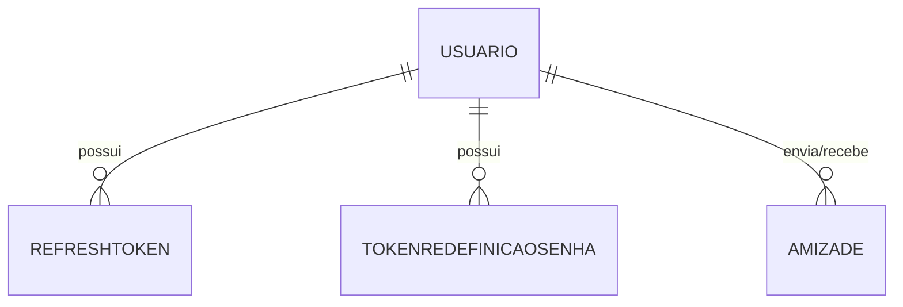
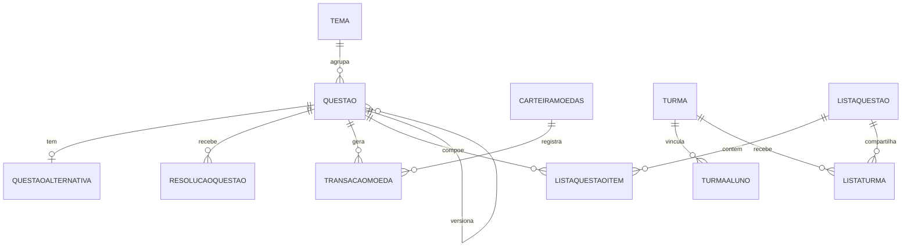

# Banco de Dados — Modelo Atual

Esta página documenta o modelo de dados **atual** do AnatoQuizUp, refletindo os schemas Prisma em produção. Para o modelo conceitual/lógico inicial (Release Major 1), consulte [Modelo V1](v1.md).

## Visão geral

A arquitetura possui **dois bancos PostgreSQL independentes**, um por serviço de domínio, **sem chave estrangeira entre serviços**:

- **Auth DB** — pertence ao `Usuario-Service`.
- **Quiz DB** — pertence ao `Quiz-Service`.

IDs de usuário usados no Quiz-Service (`Questao.criadoPorId`, `ResolucaoQuestao.usuarioId`, `Turma.professorId`, `TurmaAluno.alunoId`, `CarteiraMoedas.usuarioId`) são **referências externas** (strings), resolvidas por API (`GET /api/v1/usuarios/:id`) quando é preciso exibir nome/papel. O Quiz-Service também usa **MinIO/S3** para armazenar imagens das questões.

---

## Auth DB (Usuario-Service)

| Modelo | Principais campos | Observações |
|--------|-------------------|-------------|
| `Usuario` | `id`, `nome`, `nickname?`, `email`, `senha`, `perfil`, `status`, `visivel`, dados de aluno (`instituicao?`, `curso?`, `semestre?`, `estado?`, `cidade?`, `nacionalidade?`, `dataNascimento?`, `nivelEducacional?`), dados de professor (`departamento?`, `siape?`), aprovação (`aprovadoPorId?`, `aprovadoEm?`), timestamps | `email` e `nickname` únicos; `siape` único; `visivel` controla aparição na busca de amigos |
| `RefreshToken` | `id`, `token` (único), `usuarioId`, `expiraEm`, `revogadoEm?` | 1:N com `Usuario` (cascade) |
| `TokenRedefinicaoSenha` | `id`, `token` (único), `usuarioId`, `expiraEm`, `usadoEm?` | 1:N com `Usuario` (cascade) |
| `Amizade` | `id`, `usuarioOrigemId`, `usuarioDestinoId`, `statusAmizade`, timestamps | Único por par (`usuarioOrigemId`, `usuarioDestinoId`); ambos referenciam `Usuario` |
| `Exemplo` | `id`, `nome`, `descricao?` | Módulo técnico de referência (CRUD didático) |

### Enums (Auth DB)

| Enum | Valores |
|------|---------|
| `PerfilUsuario` | `ALUNO`, `PROFESSOR`, `ADMIN` |
| `StatusUsuario` | `PENDENTE`, `ATIVO`, `INATIVO`, `RECUSADO` |
| `NivelEducacional` | `ENSINO_FUNDAMENTAL`, `ENSINO_MEDIO`, `GRADUACAO`, `POS_GRADUACAO`, `MESTRADO`, `DOUTORADO`, `OUTRO` |
| `StatusAmizade` | `PENDENTE`, `ATIVO`, `RECUSADO` |

> O enum Prisma ainda usa `PerfilUsuario.ADMIN`; a conversão para `ADMINISTRADOR` (valor canônico do `papel` no JWT e nas respostas) é feita em runtime. A migração de renome do enum é um débito técnico aberto.

---

## Quiz DB (Quiz-Service)

| Modelo | Principais campos | Observações |
|--------|-------------------|-------------|
| `Tema` | `id`, `nome` | Agrupa questões |
| `Questao` | `id`, `enunciado`, `tipoQuestao`, `respostaCorreta`, `saibaMais?`, `status`, `feitoPorIa`, `urlImagem?`, `dificuldade`, `criadoPorId`, `temaId`, `questaoOriginalId?` | `criadoPorId` é ID externo; `questaoOriginalId` é auto-relação (versionamento); `feitoPorIa` marca questões geradas por IA |
| `QuestaoAlternativa` | `id`, `alternativaA`..`alternativaE`, `questaoId` (único) | 1:1 com `Questao` |
| `ResolucaoQuestao` | `id`, `respostaMarcada`, `usuarioId`, `questaoId` | `usuarioId` é ID externo; base do histórico e dos dashboards |
| `CarteiraMoedas` | `id`, `usuarioId` (único), `saldo` | Carteira de moedas ATP do aluno |
| `TransacaoMoeda` | `id`, `usuarioId`, `questaoId`, `quantidade`, `fonte` | Único por (`usuarioId`, `questaoId`, `fonte`) — evita recompensar a mesma questão duas vezes |
| `Turma` | `id`, `codigo` (único), `nome`, `semestre`, `ano`, `descricao`, `status`, `professorId` | `professorId` é ID externo |
| `TurmaAluno` | `id`, `turmaId`, `alunoId` | Único por (`turmaId`, `alunoId`); `alunoId` é ID externo |
| `ListaQuestao` | `id`, `nome`, `criadoPorId` | Lista de estudo |
| `ListaQuestaoItem` | `id`, `listaQuestaoId`, `questaoId`, `ordem` | Único por (`listaQuestaoId`, `questaoId`) |
| `ListaTurma` | `id`, `listaQuestaoId`, `turmaId` | Compartilha uma lista com uma turma |

### Enums (Quiz DB)

| Enum | Valores |
|------|---------|
| `TipoQuestao` | `MULTIPLA_ESCOLHA`, `CERTO_ERRADO` |
| `AlternativaQuestao` | `A`, `B`, `C`, `D`, `E` |
| `StatusQuestao` | `ATIVO`, `INATIVO` |
| `Dificuldade` | `FACIL`, `MEDIA`, `DIFICIL` |
| `StatusTurma` | `ATIVA`, `INATIVA` |
| `FonteMoeda` | `ACERTO_QUESTAO` |

---

## Referências externas entre serviços

Como não há FK entre os bancos, os relacionamentos abaixo são lógicos (por ID), não físicos:

| Campo (Quiz DB) | Referencia (Auth DB) |
|-----------------|----------------------|
| `Questao.criadoPorId` | `Usuario.id` (professor/admin autor) |
| `ResolucaoQuestao.usuarioId` | `Usuario.id` (aluno) |
| `Turma.professorId` | `Usuario.id` (professor) |
| `TurmaAluno.alunoId` | `Usuario.id` (aluno) |
| `CarteiraMoedas.usuarioId` | `Usuario.id` (aluno) |

## Histórico de Versão

| Data | Versão | Descrição | Autor(es) |
|------|--------|-----------|-----------|
| 02/06/2026 | 1.0 | Criação da página do modelo de dados atual (Auth DB e Quiz DB, com amizades, moedas, listas, turmas e enums) | [Miguel Moreira](https://github.com/EhOMiguel) |
