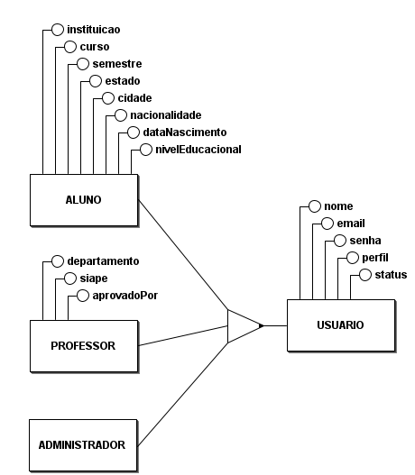
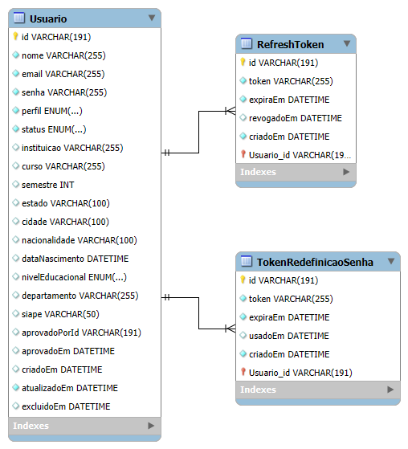

# Banco de Dados

## Objetivo

O modelo inicial do banco de dados foi elaborado com foco no módulo de autenticação e gestão de usuários da plataforma AnatoQuizUp.

Nesta primeira versão, o banco contempla:

- usuários;
- especialização de usuários em aluno, professor e administrador;
- refresh tokens;
- tokens de redefinição de senha;
- perfis de acesso;
- status de aprovação;
- dados complementares para alunos e professores.

Esta documentação representa a **versão 1** da modelagem do banco de dados. O processo seguido foi:

1. elaboração do modelo conceitual;
2. elaboração do modelo lógico;
3. implementação do schema no Prisma.

O schema Prisma foi construído a partir dos modelos apresentados abaixo.

---

## Modelo Conceitual

O modelo conceitual apresenta as entidades principais do domínio e seus relacionamentos, sem foco em detalhes físicos de implementação.

Neste modelo, a entidade central é `Usuario`, que representa qualquer pessoa cadastrada na plataforma. A partir dela, foi aplicada uma generalização/especialização para representar os três tipos de usuário existentes no sistema:

- `Aluno`;
- `Professor`;
- `Administrador`.



### Generalização e Especialização

A entidade `Usuario` concentra os atributos comuns a todos os perfis:

| Atributo | Descrição                         |
| -------- | --------------------------------- |
| `nome`   | Nome do usuário                   |
| `email`  | E-mail usado para autenticação    |
| `senha`  | Senha do usuário                  |
| `perfil` | Perfil do usuário no sistema      |
| `status` | Situação do usuário na plataforma |

A entidade `Aluno` especializa `Usuario` e possui os seguintes atributos específicos:

| Atributo           |
| ------------------ |
| `instituicao`      |
| `curso`            |
| `semestre`         |
| `estado`           |
| `cidade`           |
| `nacionalidade`    |
| `dataNascimento`   |
| `nivelEducacional` |

A entidade `Professor` especializa `Usuario` e possui os seguintes atributos específicos:

| Atributo       |
| -------------- |
| `departamento` |
| `siape`        |

A entidade `Administrador` também especializa `Usuario`, mas não possui atributos específicos nesta primeira versão do modelo.

### Aprovação de usuários

O modelo conceitual também representa a relação de aprovação entre `Administrador` e `Professor`.

Um administrador pode aprovar nenhum ou vários professores. Cada professor aprovado está associado a um administrador responsável pela aprovação.

No schema Prisma atual, essa informação aparece por meio dos campos:

| Campo           | Descrição                                  |
| --------------- | ------------------------------------------ |
| `aprovadoPorId` | Identificador de quem realizou a aprovação |
| `aprovadoEm`    | Data e hora da aprovação                   |

---

## Modelo Lógico

O modelo lógico detalha a estrutura das tabelas, seus atributos, tipos de dados, chaves primárias, chaves únicas e relacionamentos.



Na implementação lógica, a generalização/especialização do modelo conceitual foi representada em uma única tabela chamada `Usuario`.

Essa decisão segue o schema Prisma atual, no qual os diferentes tipos de usuário são controlados pelo campo `perfil`.

---

## Tabela Usuario

Representa os usuários cadastrados na plataforma.

| Campo              | Tipo           | Restrição   |
| ------------------ | -------------- | ----------- |
| `id`               | `VARCHAR(191)` | PK          |
| `nome`             | `VARCHAR(255)` | Obrigatório |
| `email`            | `VARCHAR(255)` | Único       |
| `senha`            | `VARCHAR(255)` | Obrigatório |
| `perfil`           | `ENUM`         | Obrigatório |
| `status`           | `ENUM`         | Obrigatório |
| `instituicao`      | `VARCHAR(255)` | Opcional    |
| `curso`            | `VARCHAR(255)` | Opcional    |
| `semestre`         | `INT`          | Opcional    |
| `estado`           | `VARCHAR(100)` | Opcional    |
| `cidade`           | `VARCHAR(100)` | Opcional    |
| `nacionalidade`    | `VARCHAR(100)` | Opcional    |
| `dataNascimento`   | `DATETIME`     | Opcional    |
| `nivelEducacional` | `ENUM`         | Opcional    |
| `departamento`     | `VARCHAR(255)` | Opcional    |
| `siape`            | `VARCHAR(50)`  | Único       |
| `aprovadoPorId`    | `VARCHAR(191)` | Opcional    |
| `aprovadoEm`       | `DATETIME`     | Opcional    |
| `criadoEm`         | `DATETIME`     | Obrigatório |
| `atualizadoEm`     | `DATETIME`     | Obrigatório |
| `excluidoEm`       | `DATETIME`     | Opcional    |

---

## Tabela RefreshToken

Representa os tokens usados para renovação de sessão.

| Campo        | Tipo           | Restrição   |
| ------------ | -------------- | ----------- |
| `id`         | `VARCHAR(191)` | PK          |
| `token`      | `VARCHAR(255)` | Único       |
| `expiraEm`   | `DATETIME`     | Obrigatório |
| `revogadoEm` | `DATETIME`     | Opcional    |
| `criadoEm`   | `DATETIME`     | Obrigatório |
| `Usuario_id` | `VARCHAR(191)` | FK          |

### Relacionamento

```txt
Usuario 1:N RefreshToken
```
Um usuário pode possuir vários refresh tokens. Cada refresh token pertence a um único usuário.

---

## Tabela TokenRedefinicaoSenha

Representa os tokens temporários usados no fluxo de recuperação de senha.

| Campo        | Tipo           | Restrição   |
| ------------ | -------------- | ----------- |
| `id`         | `VARCHAR(191)` | PK          |
| `token`      | `VARCHAR(255)` | Único       |
| `expiraEm`   | `DATETIME`     | Obrigatório |
| `usadoEm`    | `DATETIME`     | Opcional    |
| `criadoEm`   | `DATETIME`     | Obrigatório |
| `Usuario_id` | `VARCHAR(191)` | FK          |

### Relacionamento

```txt
Usuario 1:N TokenRedefinicaoSenha
```

Um usuário pode possuir vários tokens de redefinição de senha. Cada token pertence a um único usuário.

---

## Enums

### PerfilUsuario

Define o tipo de usuário na plataforma.

| Valor       | Descrição             |
| ----------- | --------------------- |
| `ALUNO`     | Usuário estudante     |
| `PROFESSOR` | Usuário professor     |
| `ADMIN`     | Usuário administrador |

### StatusUsuario

Define a situação da conta do usuário.

| Valor      | Descrição                     |
| ---------- | ----------------------------- |
| `PENDENTE` | Cadastro aguardando aprovação |
| `ATIVO`    | Conta ativa                   |
| `INATIVO`  | Conta desativada              |
| `RECUSADO` | Cadastro recusado             |

### NivelEducacional

Define o nível de formação informado pelo usuário.

| Valor           |
| --------------- |
| `ENSINO_MEDIO`  |
| `GRADUACAO`     |
| `POS_GRADUACAO` |
| `MESTRADO`      |
| `DOUTORADO`     |
| `OUTRO`         |

## Referências

> BRMODELO. Ferramenta utilizada para a modelagem conceitual (DER) do sistema.

> MYSQL WORKBENCH. Ferramenta utilizada para a modelagem lógica e definição das tabelas e relacionamentos.

> PRISMA. Prisma ORM Documentation. Disponível em: <https://www.prisma.io/docs>. Acesso em: 25 abr. 2026.

## Histórico de Versão

| Data   | Versão | Descrição | Autor(es) |
|--------|--------|-----------|-----------|
| 25/04/2026 | 1.0 | Criação do documento de arquitetura | [Breno Fernandes](https://github.com/brenofrds) | 