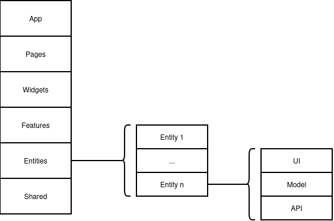

# Decisões Arquiteturais

## Estilo Arquitetural

### Frontend

#### As Camadas (Feature-Sliced Design)

A arquitetura é dividida em camadas, organizadas da mais externa (acoplada ao projeto) para a mais interna (genérica e reutilizável), sem deixar de levar em conta o domínio de negócio na organização. A regra fundamental é que uma camada superior pode importar recursos de uma inferior, mas nunca o contrário. A seguir estão descritas as camadas a serem utilizadas no frontend:

* **`app/`**: Configurações globais, roteamento base, provedores de contexto e estilos globais da aplicação. É o ponto de inicialização do sistema.
* **`pages/`**: A composição final de uma tela. As páginas reúnem `widgets` e `features` e lidam com os parâmetros das rotas, mantendo-se o mais limpas possível de lógicas complexas.
* **`widgets/`**: Blocos independentes e complexos de interface que unem várias funcionalidades em um único componente estrutural (ex: um `Header` completo ou um `Sidebar`).
* **`features/`**: Funcionalidades modulares que entregam valor de negócio direto ao usuário (ex: a ação de fazer login, enviar um formulário). Contêm as interações do usuário e as chamadas à API REST correspondentes.
* **`entities/`**: O conceito central dos dados de negócio (ex: Usuário, Produto, Cliente). Contém as tipagens, as interfaces e o gerenciamento do estado global desses dados.
* **`shared/`**: Código puramente técnico e desconectado das regras de negócio. Inclui componentes visuais genéricos (botões, inputs formatados) e configurações base de infraestrutura (como o cliente HTTP para as chamadas REST).

Com excessão de `app/` e `shared/`, todas as camadas podem ser divididas em subcamadas de domínio (slices), seguindo o princípio de tornar o projeto mais compreensível e estável diante de mudanças nos requisitos de negócio. As camadas `app/` e `shared/` e as subcamadas de domínio (slices) consistem de segmentos, que agrupam código de acordo com seu propósito (componentes de interface, comunicação com o backend, etc.). A seguir é apresentado o diagrama da arquitetura adotada:



---

#### Estrutura de Pastas

##### Frontend

A seguir está um exemplo do uso do Feature-Sliced Design na implementação do frontend:

```text
src/
├── app/
├── pages/
├── widgets/
├── features/
├── entities/
└── shared/
```

- **`app/`**: concentra a inicialização da aplicação, configurações globais, provedores, estilos e definição base de rotas.
- **`pages/`**: representa as páginas finais da aplicação, compondo `widgets` e `features` conforme a navegação do usuário.
- **`widgets/`**: reúne blocos mais complexos de interface, formados por múltiplos componentes e comportamentos.
- **`features/`**: implementa funcionalidades orientadas ao usuário, como autenticação, envio de formulários e fluxos de interação.
- **`entities/`**: organiza os modelos centrais do domínio, incluindo tipagens, estado e regras relacionadas às entidades do sistema.
- **`shared/`**: contém recursos reutilizáveis e desacoplados do domínio, como componentes genéricos, utilitários e infraestrutura técnica.

##### Backend

A API backend adota uma estrutura modular para separar configuração, domínio, utilitários compartilhados e apoio à manutenção do projeto:

```text
anatoquizup-api/
├── .github/
│   ├── ISSUE_TEMPLATE/
│   └── workflows/
├── prisma/
│   └── migrations/
├── src/
│   ├── config/
│   ├── modules/
│   │   └── domain/
│   │       ├── dto/
│   │       └── __tests__/
│   └── shared/
│       ├── constants/
│       ├── errors/
│       ├── middlewares/
│       ├── types/
│       └── utils/
└── tests/
```

- **`.github/`**: armazena arquivos de automação e apoio ao fluxo de colaboração do repositório.
- **`.github/ISSUE_TEMPLATE/`**: define modelos padronizados para abertura de issues.
- **`.github/workflows/`**: concentra fluxos de integração contínua e automações do GitHub Actions.
- **`prisma/`**: reúne os artefatos de persistência e versionamento do banco de dados.
- **`prisma/migrations/`**: guarda o histórico de migrations aplicadas ao esquema do banco.
- **`src/`**: contém o código-fonte principal da API.
- **`src/config/`**: centraliza configurações da aplicação, como variáveis de ambiente, integração de serviços e parâmetros globais.
- **`src/modules/`**: organiza as funcionalidades da API por módulo de negócio.
- **`src/modules/domain/`**: representa um módulo funcional da aplicação com rotas, controller, service, repository e schemas relacionados.
- **`src/modules/domain/dto/`**: concentra os tipos e contratos de entrada e saída usados pelo módulo.
- **`src/modules/domain/__tests__/`**: reserva os testes automatizados específicos do módulo.
- **`src/shared/`**: agrupa recursos compartilhados entre diferentes módulos da aplicação.
- **`src/shared/constants/`**: define constantes reutilizadas em diferentes partes do backend.
- **`src/shared/errors/`**: implementa classes e códigos de erro padronizados para tratamento de exceções.
- **`src/shared/middlewares/`**: reúne middlewares reutilizáveis, como autenticação e autorização.
- **`src/shared/types/`**: centraliza tipagens comuns utilizadas em múltiplos módulos.
- **`src/shared/utils/`**: contém funções utilitárias e helpers compartilhados.
- **`tests/`**: concentra a estrutura de testes em nível de aplicação.

## Referências

> Feature-Sliced Design. Overview. Disponível em: <https://feature-sliced.design/docs/get-started/overview>. Acesso em: 17 abr. 2026.

## Histórico de Versão

| Data   | Versão | Descrição | Autor(es) |
|--------|--------|-----------|-----------|
| 14/04/2026 | 1.2 | Adicionando estrutura de pastas frontend | [Pedro Cabeceira](https://github.com/pkbceira03) |
| 17/04/2026 | 1.3 | Adicionando diagrama arquitetural frontend | [João Vitor](https://github.com/Joa0V) | 
| 18/04/2026 | 1.4 | Adicionando estrutura de pastas backend | [Bruno Ricardo](https://github.com/EhOBruno) |
| 26/04/2026 | 1.5 | Reorganização da seção de arquitetura, concentrando arquiteturais e estruturas adotadas em uma página só| [Ana Catarina](https://github.com/an4catarina) |
