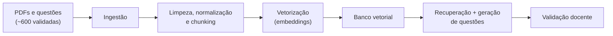

# Inteligência Artificial

## Visão geral

A Inteligência Artificial é a principal adição de valor do AnatoQuizUp em relação ao projeto original. Estão previstos **três módulos de IA**, consumidos sempre através do BFF (rota `/api/v1/ia/*`), nunca diretamente pelo Frontend:

1. **Geração de Questões por IA** — modelo ajustado com base no banco de questões existente (~600 questões validadas) que aprende o padrão dos professores e gera novas questões. Toda questão gerada passa por **aprovação docente** antes de entrar no banco oficial.
2. **Geração de Imagens Anatômicas por IA** — geração de imagens contextualizadas para acompanhar questões.
3. **Chatbot Educacional** — assistente treinado com o banco de questões e livros digitais do acervo da UnB sobre anatomia.

## Estado atual

- O **AI Service** (`2026-1-AnatoQuizUp-AI`) está em estruturação; enquanto não há aplicação publicada, o BFF responde **`503 IA_INDISPONIVEL`** em qualquer chamada `/api/v1/ia/*`.
- A arquitetura já reserva o roteamento pelo BFF e um banco próprio para o serviço (ver [Visão Geral da Arquitetura](visao_geral.md)).
- O foco da Release Major 3 é o **Módulo 1 — Geração de Questões (texto)**, por meio de uma estrutura de **RAG (Retrieval-Augmented Generation)**.

## Estrutura RAG de questões (texto)

A entrega planejada é um **pipeline funcional de ingestão contínua de questões no banco vetorial do RAG**, que servirá de base de recuperação para a geração de novas questões.

## Cronograma

| Semana | Período | Atividade |
|--------|---------|-----------|
| Semana 1 | 24/05 – 30/05 | Definição da arquitetura do RAG, ingestão de PDFs e estruturação do dataset |
| Semana 2 | 31/05 – 06/06 | Limpeza, normalização e chunking das questões |
| Semana 3 | 07/06 – 13/06 | Vetorização do texto — geração dos embeddings |
| Semana 4 | 14/06 – 20/06 | Pipeline de ingestão contínua ao banco vetorial |
| Semana 5 | 21/06 – 27/06 | Handoff técnico — documentação e roadmap para a próxima equipe |

## Entrega

Pipeline funcional de **ingestão contínua de questões no banco vetorial do RAG**, documentado e com roadmap de continuidade para a próxima equipe (handoff técnico).

## Stack em avaliação

A stack definitiva será confirmada ao longo do desenvolvimento. As opções em avaliação incluem Python + FastAPI para o serviço, um banco vetorial (por exemplo `pgvector`, Chroma ou Pinecone) para os embeddings, e um LLM a definir conforme custo, latência e qualidade nos testes com as questões da UnB.

## Histórico de Versão

| Data   | Versão | Descrição | Autor(es) |
|--------|--------|-----------|-----------|
| 02/06/2026 | 1.0 | Criação da página de Inteligência Artificial (módulos planejados, estrutura RAG de questões, cronograma e entrega) | [Miguel Moreira](https://github.com/EhOMiguel) |
