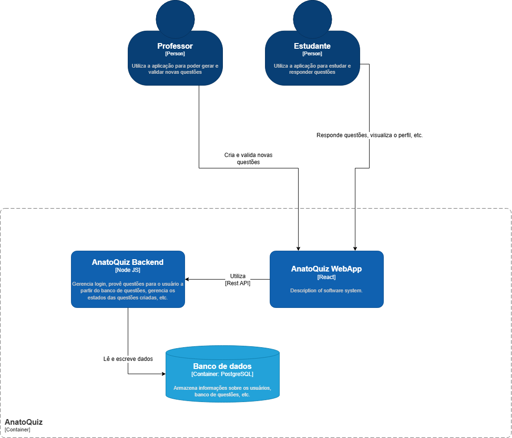

# Visão Geral da Arquitetura

O AnatoQuizUp é uma plataforma web de quiz de anatomia composta por três partes principais: **frontend**, **backend** e **banco de dados**. Essa separação organiza a solução em camadas com responsabilidades claras e permite que interface, regras de negócio e persistência evoluam de forma independente.

O frontend é responsável pela experiência do usuário no navegador. O backend concentra as regras de negócio, autenticação, autorização e exposição da API REST. O banco de dados persiste usuários, sessões, tokens e, nas próximas evoluções do produto, questões, respostas e dados de desempenho.

## Diagrama geral

## Contêineres principais

### Frontend Web

Aplicação React responsável por telas, formulários, navegação, estado de autenticação no cliente e comunicação com a API. A organização interna segue Feature-Sliced Design, separando `app`, `pages`, `widgets`, `features`, `entities` e `shared`.

### Backend API

Aplicação Node.js com Express responsável pelos endpoints REST, validações, autenticação, autorização, regras de negócio e integração com o banco via Prisma. Os módulos de domínio seguem uma estrutura baseada em controller, service, repository, schemas, DTOs e rotas.

### Banco de Dados

Banco PostgreSQL responsável pela persistência dos dados estruturados do sistema. Na base atual, armazena usuários, refresh tokens e tokens de redefinição de senha; futuramente também armazenará entidades relacionadas a questões, respostas e desempenho.

## Visões detalhadas

- [Visão Lógica](./visoes/logica.md): módulos, componentes e responsabilidades lógicas do sistema.
- [Visão de Processos](./visoes/processos.md): fluxos de execução e interação entre componentes.
- [Visão de Implementação](./visoes/implementacao.md): organização física do código e repositórios.
- [Visão de Implantação](./visoes/implantacao.md): ambientes, infraestrutura e deploy.
- [Banco de Dados](./banco-de-dados/v1.md): modelagem e estrutura de persistência.
- [Tecnologias](./tecnologias.md): stack tecnológica utilizada.
- [Decisões Arquiteturais](./decisoes.md): decisões consolidadas e suas consequências.

## Histórico de Versão

| Data   | Versão | Descrição | Autor(es) |
|--------|--------|-----------|-----------|
| 10/04/2026 | 1.0 | Criação do documento de arquitetura | [Caio Santos](https://github.com/caiobsantos) |
| 26/04/2026 | 1.1 | Reorganização da seção de arquitetura, mantendo apenas a visão geral da solução | [Ana Catarina](https://github.com/an4catarina) |
| 27/04/2026 | 1.2 | Atualização da visão geral com resumo dos contêineres e links para as visões arquiteturais | [Breno Fernandes](https://github.com/Brenofrds) |
