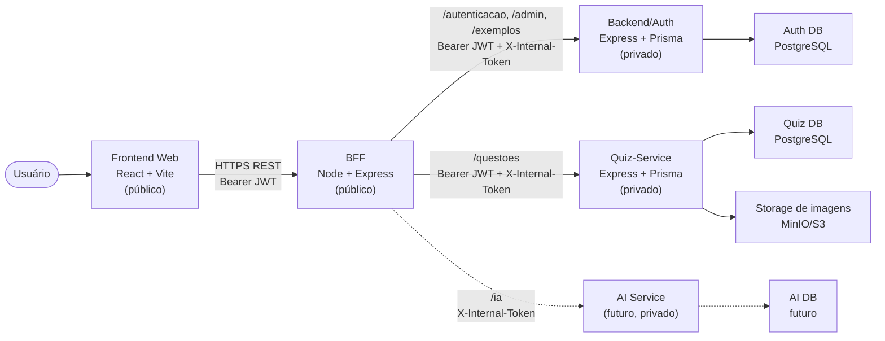

# Visão Geral da Arquitetura

O AnatoQuizUp é uma plataforma web de quiz de anatomia organizada em serviços com responsabilidades separadas. O Frontend consome somente o BFF. O BFF é o único endereço público da camada de serviços e roteia chamadas para Backend/Auth, Quiz-Service ou AI conforme o caminho da URL.

A arquitetura atual possui bancos separados por serviço:

- **Backend/Auth DB:** usuários, refresh tokens, tokens de redefinição e dados administrativos.
- **Quiz DB:** temas, questões, alternativas, resoluções e metadados de quiz.
- **AI DB futuro:** dados de IA quando o serviço for implementado.

## Diagrama geral

## Componentes

### Frontend Web

Aplicação React responsável por telas, formulários, navegação e estado de autenticação no cliente. Acessa apenas o BFF, nunca Backend/Auth, Quiz-Service ou AI diretamente.

### BFF

Proxy de orquestração sem banco e sem regra de negócio. Valida JWT na borda, injeta `X-Internal-Token`, repassa `Authorization` e headers auxiliares (`X-User-Id`, `X-User-Papel`, `X-User-Status`) e preserva o contrato público usado pelo Web.

### Backend/Auth

Serviço privado responsável por autenticação, identidade, administração de usuários, exemplos técnicos e banco de autenticação. Não possui mais lógica, tabelas ou storage de questões.

### Quiz-Service

Serviço privado responsável pelo domínio de quiz já existente: temas, questões, alternativas, resoluções e infraestrutura de imagens de questões. Valida o JWT localmente com `JWT_SECRET_KEY`; os headers `X-User-*` são apenas informativos.

### AI Service

Serviço reservado para semestres futuros. Permanece sem funcionalidade nesta etapa, mas a arquitetura já reserva banco próprio e roteamento pelo BFF.

## Visões detalhadas

- [Visão Lógica](./visoes/logica.md): módulos, componentes e responsabilidades lógicas do sistema.
- [Visão de Processos](./visoes/processos.md): fluxos de execução e interação entre componentes.
- [Visão de Implementação](./visoes/implementacao.md): organização física do código e repositórios.
- [Visão de Implantação](./visoes/implantacao.md): ambientes, infraestrutura e deploy.
- [Banco de Dados](./banco-de-dados/v1.md): modelagem e estrutura de persistência.
- [Tecnologias](./tecnologias.md): stack tecnológica utilizada.
- [Decisões Arquiteturais](./decisoes.md): decisões consolidadas e suas consequências.

## Histórico de Versão

| Data | Versão | Descrição | Autor(es) |
|------|--------|-----------|-----------|
| 10/04/2026 | 1.0 | Criação do documento de arquitetura | [Caio Santos](https://github.com/caiobsantos) |
| 26/04/2026 | 1.1 | Reorganização da seção de arquitetura | [Ana Catarina](https://github.com/an4catarina) |
| 27/04/2026 | 1.2 | Atualização da visão geral com resumo dos contêineres | [Breno Fernandes](https://github.com/Brenofrds) |
| 05/05/2026 | 1.3 | Atualização para refletir a introdução do BFF | [Miguel Moreira](https://github.com/miguelmsoliveira) |
| 13/05/2026 | 2.0 | Atualização para Backend/Auth, Quiz-Service e bancos por serviço | Miguel Moreira |
| 13/05/2026 | 2.1 | Restauração dos acentos do português brasileiro | Miguel Moreira |
