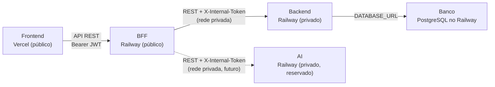

# Visão de Implantação

A visão de implantação mostra onde cada parte do sistema roda e como elas se comunicam.

## Visão geral

O AnatoQuizUp é dividido em **quatro contêineres ativos** (frontend, BFF, backend, banco de dados) e um quinto reservado (AI). O BFF é o **único endereço público** entre os serviços; Backend e AI ficam em rede privada.



## Situação atual

- O frontend já está publicado na Vercel.
- O BFF é um serviço novo (introduzido em 05/05/2026), com deploy planejado para o Railway.
- O backend ainda não foi publicado.
- O banco de dados ainda não foi publicado.
- O AI permanece sem código nesta release.

Frontend em produção:

```text
https://2026-1-anato-quiz-up-web.vercel.app/login
```

## Ambiente local

| Parte | Ambiente local |
|-------|----------------|
| Frontend | `localhost:5173` |
| BFF | `localhost:4000` |
| Backend | `localhost:3333` |
| AI | (reservado) |
| Banco de dados | PostgreSQL via Docker |

> Em desenvolvimento, sobem três processos: Backend (3333), BFF (4000) e Web (5173). O Frontend nunca chama o Backend diretamente — sempre via BFF.

## Produção planejada

| Parte | Serviço planejado |
|-------|-------------------|
| Frontend | Vercel |
| BFF | Railway (público) |
| Backend | Railway (rede privada) |
| AI | Railway (rede privada, reservado) |
| Banco de dados | PostgreSQL no Railway |

O Railway é a opção preferida porque permite subir BFF, backend, AI e banco na mesma plataforma, com rede privada interna entre os serviços e domínio público apenas para o BFF.

## Alternativa

Caso o custo do Railway, estimado em cerca de 5 dólares por mês, não seja aprovado, a alternativa considerada é:

| Parte | Serviço alternativo |
|-------|---------------------|
| BFF | Render |
| Backend | Render |
| Banco de dados | Supabase |

Problemas dessa alternativa:

- Render pode hibernar, deixando o primeiro acesso mais lento depois de um período sem uso.
- O banco precisa ficar em outro serviço, como Supabase.
- A implantação fica distribuída entre mais plataformas.
- A manutenção fica mais complexa para o time.
- Não há rede privada nativa equivalente à do Railway entre os serviços; a proteção do Backend dependeria mais fortemente do `X-Internal-Token` e de regras de origem.

## Decisão atual

- O frontend já está na Vercel.
- BFF, Backend, AI e banco serão publicados preferencialmente no Railway, com Backend e AI em rede privada.
- Railway é a melhor opção para o time por permitir privatização entre serviços e ser simples de mexer.
- Render + Supabase fica apenas como alternativa caso o custo do Railway não seja aprovado.
- No futuro, o frontend também pode ser migrado para Railway se fizer sentido para centralizar a implantação.

## Histórico de Versão

| Data   | Versão | Descrição | Autor(es) |
|--------|--------|-----------|-----------|
| 27/04/2026 | 1.0 | Criação da visão de implantação com ambientes e opções de hospedagem | [Breno Fernandes](https://github.com/Brenofrds) |
| 05/05/2026 | 1.1 | Atualização para refletir BFF público, Backend e AI privados em rede interna do Railway (PRD: Migração para Arquitetura com BFF) | [Miguel Moreira](https://github.com/miguelmsoliveira) |
