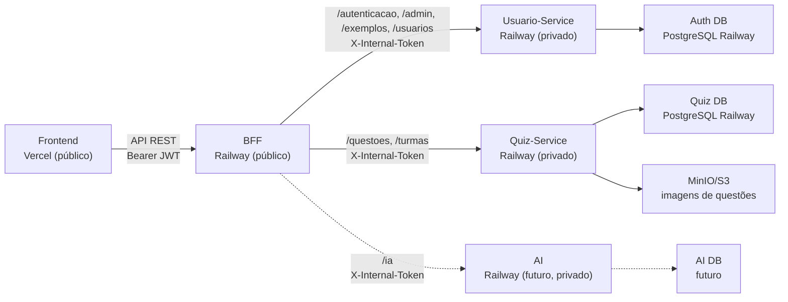

# Visão de Implantação

A visão de implantação mostra onde cada parte do sistema roda e como os serviços se comunicam. A topologia atual separa Usuario-Service e Quiz-Service, cada um com banco próprio.

## Visão geral

## Ambiente local

| Parte | Ambiente local |
|-------|----------------|
| Frontend | `localhost:5173` |
| BFF | `localhost:4000` |
| Usuario-Service | `localhost:3333` |
| Quiz-Service | `localhost:3334` |
| AI | reservado |
| Auth DB | Postgres via Docker em `localhost:5432` |
| Quiz DB | Postgres via Docker em `localhost:5433` |
| MinIO API | `localhost:9000` |
| MinIO Console | `localhost:9001` |

Em desenvolvimento, o Web continua chamando apenas `http://localhost:4000/api/v1`. O BFF decide o destino interno por path.

## Produção planejada

| Parte | Serviço planejado |
|-------|-------------------|
| Frontend | Vercel |
| BFF | Railway com domínio público |
| Usuario-Service | Railway em rede privada |
| Quiz-Service | Railway em rede privada |
| AI | Railway em rede privada, futuro |
| Auth DB | PostgreSQL separado |
| Quiz DB | PostgreSQL separado |
| AI DB | PostgreSQL separado quando AI existir |
| Storage de questões | MinIO/S3 sob responsabilidade do Quiz-Service |

O Railway continua sendo a opção preferida porque permite rede privada entre BFF e serviços internos. O Usuario-Service e o Quiz-Service também validam `X-Internal-Token`, então chamadas diretas sem o token são rejeitadas.

## Variáveis essenciais

| Variável | Usada por | Observação |
|----------|-----------|------------|
| `BACKEND_URL` | BFF | URL privada do Usuario-Service |
| `QUIZ_SERVICE_URL` | BFF | URL privada do Quiz-Service |
| `AI_URL` | BFF | Vazio enquanto AI for placeholder |
| `JWT_SECRET_KEY` | BFF, Usuario-Service, Quiz-Service | Usuario-Service assina; BFF e Quiz-Service validam |
| `INTERNAL_TOKEN` | BFF, Usuario-Service, Quiz-Service | BFF injeta; serviços internos validam |
| `DATABASE_URL` | Usuario-Service, Quiz-Service, AI futuro | Cada serviço usa sua própria URL de banco |

## Alternativa

Caso o custo do Railway não seja aprovado, Render + Supabase continua sendo alternativa, mas com maior complexidade operacional e menor isolamento de rede privada. Nesse caso, `X-Internal-Token` fica ainda mais importante para proteger os serviços privados.

## Histórico de Versão

| Data | Versão | Descrição | Autor(es) |
|------|--------|-----------|-----------|
| 27/04/2026 | 1.0 | Criação da visão de implantação | [Breno Fernandes](https://github.com/Brenofrds) |
| 05/05/2026 | 1.1 | Atualização para refletir BFF público e Usuario-Service/AI privados | [Miguel Moreira](https://github.com/miguelmsoliveira) |
| 13/05/2026 | 2.0 | Atualização para Quiz-Service privado e bancos por serviço | Miguel Moreira |
| 13/05/2026 | 2.1 | Restauração dos acentos do português brasileiro | Miguel Moreira |
