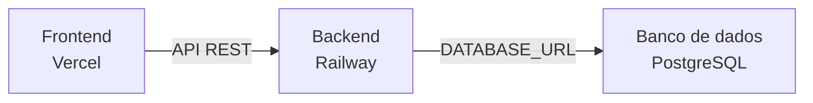

# Visão de Implantação

A visão de implantação mostra onde cada parte do sistema roda e como elas se comunicam.

## Visão geral

O AnatoQuizUp é dividido em três partes principais:

- frontend;
- backend;
- banco de dados.



## Situação atual

- O frontend já está publicado na Vercel.
- O backend ainda não foi publicado.
- O banco de dados ainda não foi publicado.

Frontend em produção:

```text
https://2026-1-anato-quiz-up-web.vercel.app/login
```

## Ambiente local

| Parte | Ambiente local |
|-------|----------------|
| Frontend | `localhost:5173` |
| Backend | `localhost:3333` |
| Banco de dados | PostgreSQL via Docker |

## Produção planejada

A ideia do time é usar:

| Parte | Serviço planejado |
|-------|-------------------|
| Frontend | Vercel |
| Backend | Railway |
| Banco de dados | PostgreSQL no Railway |

O Railway é a opção preferida porque permite subir backend e banco na mesma plataforma e é mais simples para o time configurar e manter.

## Alternativa

Caso o custo do Railway, estimado em cerca de 5 dólares por mês, não seja aprovado, a alternativa considerada é:

| Parte | Serviço alternativo |
|-------|---------------------|
| Backend | Render |
| Banco de dados | Supabase |

Problemas dessa alternativa:

- Render pode hibernar, deixando o primeiro acesso mais lento depois de um período sem uso.
- O banco precisa ficar em outro serviço, como Supabase.
- A implantação fica distribuída entre mais plataformas.
- A manutenção fica mais complexa para o time.

## Decisão atual

- O frontend já está na Vercel.
- Backend e banco serão publicados preferencialmente no Railway.
- Railway é a melhor opção para o time por ser mais simples de mexer.
- Render + Supabase fica apenas como alternativa caso o custo do Railway não seja aprovado.
- No futuro, o frontend também pode ser migrado para Railway se fizer sentido para centralizar a implantação.

## Histórico de Versão

| Data   | Versão | Descrição | Autor(es) |
|--------|--------|-----------|-----------|
| 27/04/2026 | 1.0 | Criação da visão de implantação com ambientes e opções de hospedagem | [Breno Fernandes](https://github.com/Brenofrds) |
