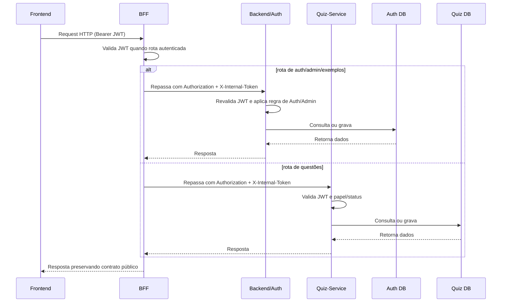

# Visão Lógica

A visão lógica descreve a decomposição funcional do AnatoQuizUp em camadas e serviços de domínio. A regra principal é simples: o Frontend fala somente com o BFF; o BFF roteia; cada serviço de domínio aplica suas próprias regras e persiste no seu próprio banco.

## Organização geral

- **Frontend Web:** interface usada por alunos, professores e administradores.
- **BFF:** ponto de entrada público; valida JWT na borda; injeta token interno; roteia chamadas.
- **Backend/Auth:** autenticação, identidade, administração de usuários e exemplos técnicos.
- **Quiz-Service:** questões e lógica de quiz já existente.
- **AI Service:** reservado para funcionalidades futuras de IA.

## Frontend

O Frontend segue Feature-Sliced Design.

| Camada | Responsabilidade |
|--------|------------------|
| `app` | Inicialização da aplicação, rotas, providers e estilos globais. |
| `pages` | Telas acessadas pelo usuário. |
| `widgets` | Blocos maiores de interface. |
| `features` | Funcionalidades do usuário, como login e gerenciamento de questões. |
| `entities` | Modelos centrais do domínio. |
| `shared` | Componentes genéricos, cliente HTTP, configurações e utilitários. |

## BFF

O BFF é um proxy de orquestração, sem persistência e sem regra de negócio.

| Componente | Responsabilidade |
|------------|------------------|
| Rotas | Definem prefixos públicos (`/api/v1/autenticacao`, `/api/v1/admin`, `/api/v1/exemplos`, `/api/v1/questoes`, `/api/v1/ia`). |
| Middlewares | Validam JWT, filtram headers, injetam `X-Internal-Token` e tratam erros. |
| Clientes HTTP | `backend.client`, `quiz.client` e `ai.client`. |

## Backend/Auth

O Backend/Auth é privado e concentra identidade.

| Módulo | Responsabilidade |
|--------|------------------|
| `auth` | Cadastro, login, logout, refresh token e recuperação de senha. |
| `admin` | Administração de usuários e aprovação de professores. |
| `exemplo` | Módulo técnico de referência mantido nesta etapa. |

## Quiz-Service

O Quiz-Service é privado e concentra o domínio de quiz.

| Módulo | Responsabilidade |
|--------|------------------|
| `questoes` | CRUD de questões, alternativas, temas e resoluções migradas do Backend. |
| `storage` | Infraestrutura de imagens de questões via MinIO/S3. |

O Quiz-Service valida o JWT localmente com `JWT_SECRET_KEY`. Autorização usa `papel` e `status` vindos do JWT assinado; `X-User-*` é apenas apoio para observabilidade.

## Relação entre as camadas

## Histórico de Versão

| Data | Versão | Descrição | Autor(es) |
|------|--------|-----------|-----------|
| 27/04/2026 | 1.0 | Criação da visão lógica da arquitetura | [Breno Fernandes](https://github.com/Brenofrds) |
| 27/04/2026 | 1.1 | Simplificação da visão lógica | [Breno Fernandes](https://github.com/Brenofrds) |
| 05/05/2026 | 1.2 | Inclusão do BFF como camada lógica entre Frontend e Backend | [Miguel Moreira](https://github.com/miguelmsoliveira) |
| 13/05/2026 | 2.0 | Atualização para Backend/Auth, Quiz-Service e bancos separados | Miguel Moreira |
| 13/05/2026 | 2.1 | Restauração dos acentos do português brasileiro | Miguel Moreira |
