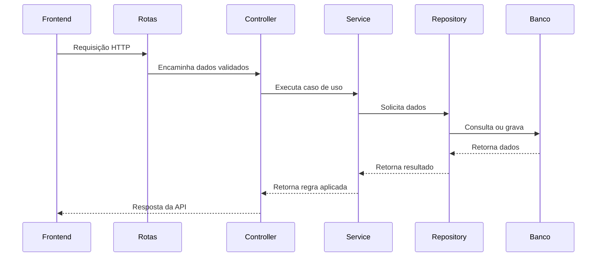

# Visão Lógica

A visão lógica descreve a decomposição funcional do AnatoQuizUp em módulos e componentes. Ela mostra quais partes compõem o sistema, quais responsabilidades cada camada possui e como frontend, backend, domínio e banco de dados se relacionam.

## Organização geral

O sistema é organizado em três blocos principais:

- **Frontend Web:** interface usada por alunos, professores e administradores.
- **Backend API:** camada responsável por regras de negócio, autenticação, autorização e exposição dos endpoints.
- **Banco de Dados:** persistência dos dados da aplicação.

## Frontend

O frontend é organizado em camadas seguindo Feature-Sliced Design. Essa divisão ajuda a separar telas, funcionalidades, componentes estruturais, modelos de domínio e recursos compartilhados.

| Camada | Responsabilidade |
|--------|------------------|
| `app` | Inicialização da aplicação, rotas, providers e estilos globais. |
| `pages` | Telas acessadas pelo usuário. |
| `widgets` | Blocos maiores de interface, como cabeçalho, navegação e layouts. |
| `features` | Funcionalidades do usuário, como login, cadastro, recuperação de senha e gerenciamento. |
| `entities` | Modelos centrais do domínio, como usuário, perfil e status. |
| `shared` | Componentes genéricos, cliente HTTP, configurações e utilitários. |

## Backend

O backend é organizado em módulos de domínio. Cada módulo deve reunir suas rotas, validações, controllers, services, repositories, DTOs e testes.

| Componente | Responsabilidade |
|------------|------------------|
| Rotas | Definem os endpoints HTTP e aplicam middlewares. |
| Middlewares | Tratam validação, autenticação, autorização e erros. |
| Controllers | Recebem requisições e chamam os serviços. |
| Services | Concentram regras de negócio. |
| Repositories | Isolam o acesso ao banco de dados. |
| Schemas | Validam entradas com Zod. |
| DTOs | Definem contratos de entrada e saída. |

## Módulos principais

Os principais módulos lógicos previstos para o sistema são:

| Módulo | Responsabilidade |
|--------|------------------|
| Autenticação | Cadastro, login, logout, tokens e recuperação de senha. |

## Relação entre as camadas

O frontend não acessa o banco diretamente. As telas e funcionalidades do cliente chamam a API REST do backend, que valida os dados recebidos, aplica as regras de negócio e acessa o banco por meio do Prisma.

O backend retorna respostas padronizadas para que o frontend consiga tratar sucesso, erro e paginação de forma consistente.

## Histórico de Versão

| Data   | Versão | Descrição | Autor(es) |
|--------|--------|-----------|-----------|
| 27/04/2026 | 1.0 | Criação da visão lógica da arquitetura | [Breno Fernandes](https://github.com/Brenofrds) |
| 27/04/2026 | 1.1 | Simplificação da visão lógica com foco em módulos, camadas e responsabilidades | [Breno Fernandes](https://github.com/Brenofrds) |
