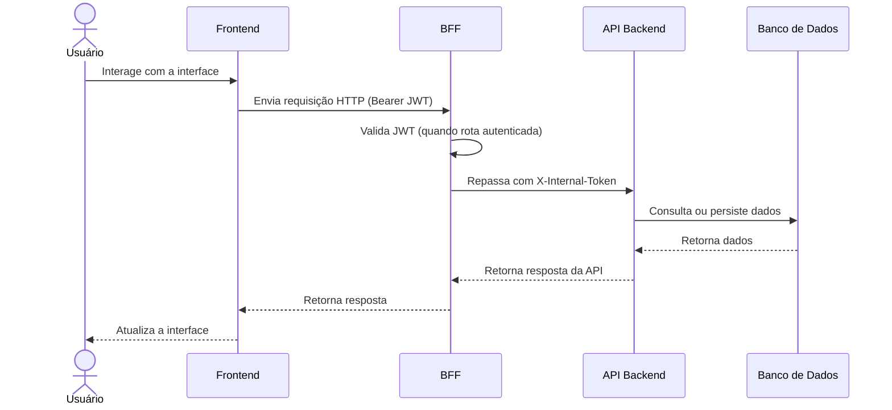
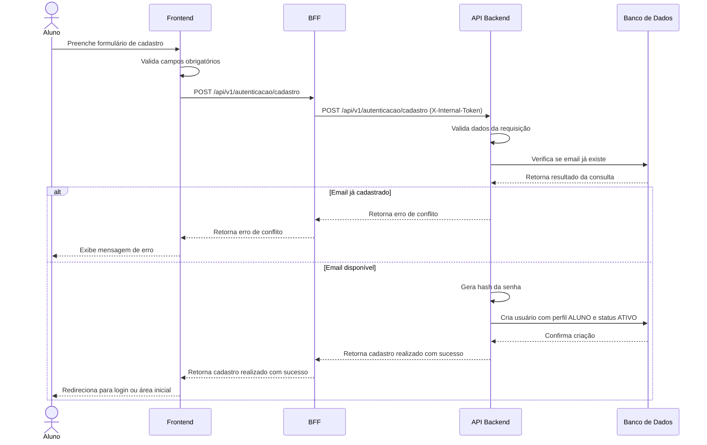
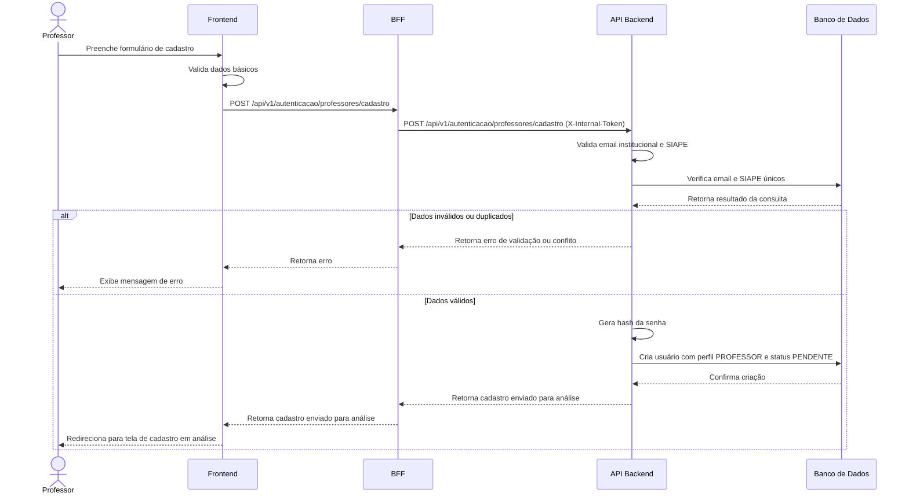
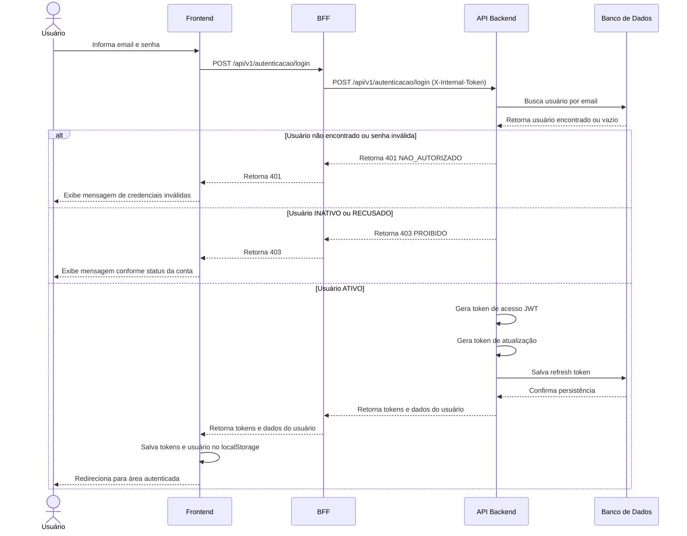
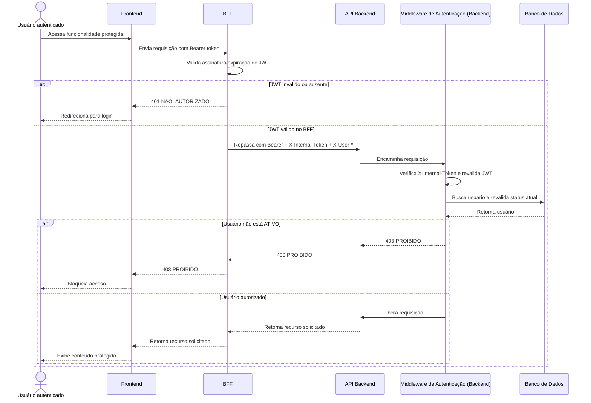
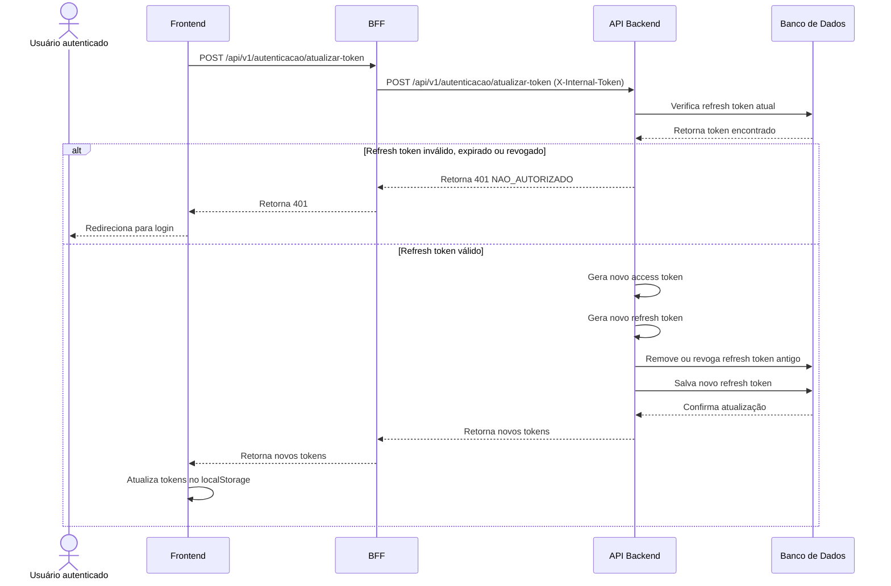
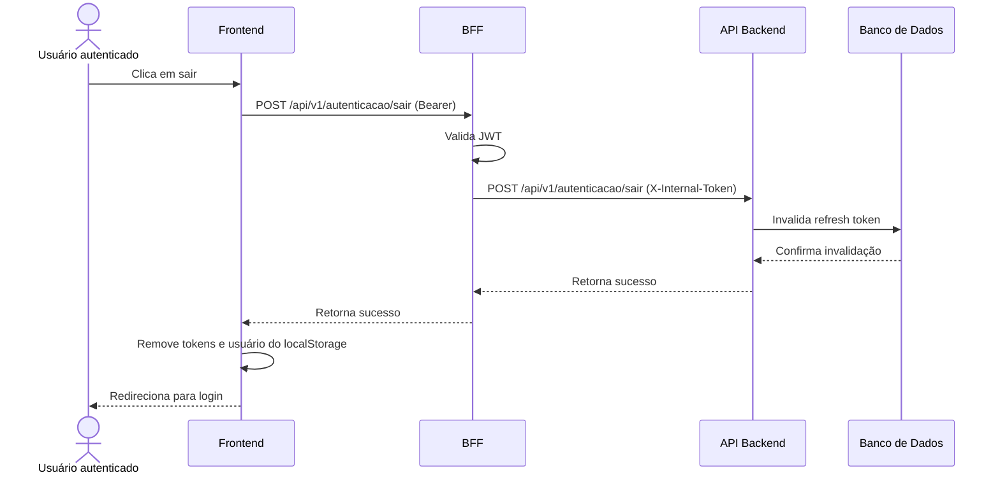
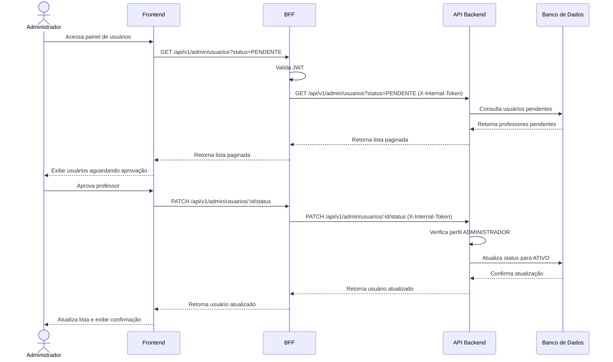

# Visão de Processos

Este documento apresenta a visão de processos do AnatoQuizUp, descrevendo como os principais fluxos da aplicação se comportam em tempo de execução.

A visão de processos foca na interação entre usuário, frontend, BFF, backend e banco de dados durante a execução das funcionalidades principais da Release Major 1.

## Fluxo geral

Em alto nível, os processos da aplicação seguem o seguinte fluxo:

## Processos Especificos

### Processo de cadastro de aluno

### Processo de cadastro de professor

### Processo de login

### Processo de autenticação com JWT em rota protegida

### Processo de atualização de token

### Processo de logout

### Processo de aprovação de professor pelo administrador

## Observações arquiteturais

O frontend não acessa diretamente o backend nem o banco de dados; toda chamada passa pelo BFF.
O BFF não tem regras de negócio — é proxy 100% orquestração: valida JWT, injeta `X-Internal-Token` e cabeçalhos auxiliares (`X-User-Id`, `X-User-Profile`, `X-User-Status`) e repassa.
Toda regra de autenticação, autorização e persistência permanece no backend.
O access token é usado para autenticar requisições protegidas. O JWT é validado em duas camadas (BFF e Backend) — defesa em profundidade.
O refresh token é persistido no banco e utilizado para renovação de sessão.
O status do usuário deve ser revalidado no backend a cada requisição protegida.
Usuários com status diferente de ATIVO não devem acessar funcionalidades autenticadas.

## Histórico de Versão

| Data   | Versão | Descrição | Autor(es) |
|--------|--------|-----------|-----------|
| 26/04/2026 | 1.0 | 1.0	Criação da visão de processos da arquitetura | [Breno Fernandes](https://github.com/brenofrds) |
| 05/05/2026 | 1.1 | Atualização de todos os diagramas para incluir o BFF como ator intermediário entre Frontend e Backend (PRD: Migração para Arquitetura com BFF) | [Miguel Moreira](https://github.com/miguelmsoliveira) |
