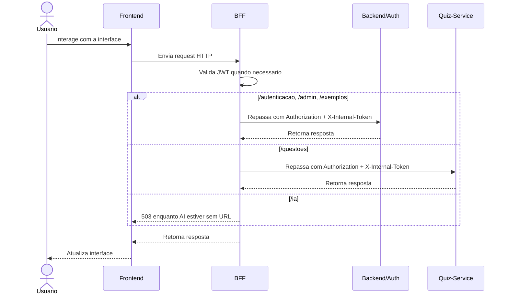
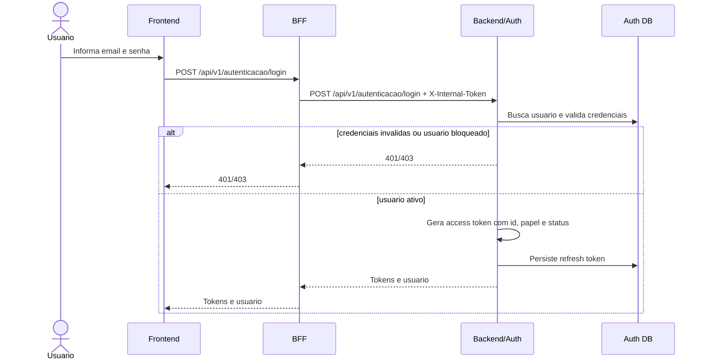
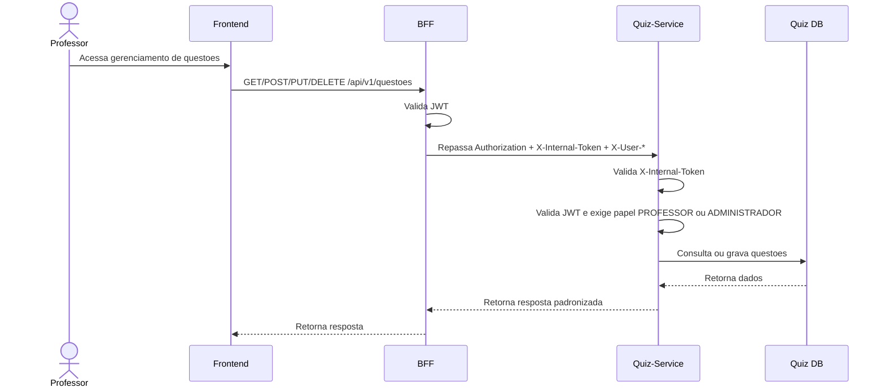

# Visao de Processos

Este documento descreve como os principais fluxos do AnatoQuizUp passam pelo Frontend, BFF e servicos internos. A arquitetura atual separa os fluxos de identidade dos fluxos de quiz.

## Fluxo geral

## Cadastro de aluno

## Login

## Rota autenticada de Auth/Admin

## Gestao de questoes

## Observacoes arquiteturais

- O Frontend nao acessa Backend/Auth, Quiz-Service, AI ou bancos diretamente.
- O BFF nao tem regra de negocio nem banco.
- Backend/Auth e Quiz-Service validam `X-Internal-Token`.
- O nome canonico do papel no JWT e `papel`; `perfil` e legado.
- O Quiz-Service nao acessa a tabela de usuarios do Backend/Auth.
- Para nomes/emails de autores em telas futuras, a composicao deve ser feita por API, preferencialmente com lookup em lote pelo BFF.

## Historico de Versao

| Data | Versao | Descricao | Autor(es) |
|------|--------|-----------|-----------|
| 26/04/2026 | 1.0 | Criacao da visao de processos da arquitetura | [Breno Fernandes](https://github.com/brenofrds) |
| 05/05/2026 | 1.1 | Atualizacao para incluir o BFF como ator intermediario | [Miguel Moreira](https://github.com/miguelmsoliveira) |
| 13/05/2026 | 2.0 | Inclusao dos fluxos do Quiz-Service e bancos separados | Miguel Moreira |
