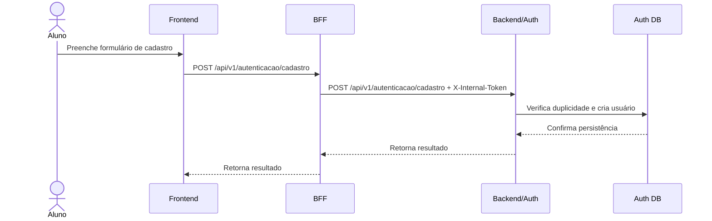
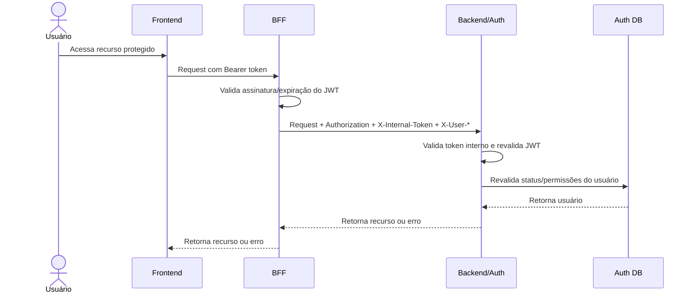

# Visão de Processos

Este documento descreve como os principais fluxos do AnatoQuizUp passam pelo Frontend, BFF e serviços internos. A arquitetura atual separa os fluxos de identidade dos fluxos de quiz.

## Fluxo geral

## Cadastro de aluno

## Login

## Rota autenticada de Auth/Admin

## Gestão de questões

## Observações arquiteturais

- O Frontend não acessa Backend/Auth, Quiz-Service, AI ou bancos diretamente.
- O BFF não tem regra de negócio nem banco.
- Backend/Auth e Quiz-Service validam `X-Internal-Token`.
- O nome canônico do papel no JWT é `papel`; `perfil` é legado.
- O Quiz-Service não acessa a tabela de usuários do Backend/Auth.
- Para nomes/emails de autores em telas futuras, a composição deve ser feita por API, preferencialmente com lookup em lote pelo BFF.

## Histórico de Versão

| Data | Versão | Descrição | Autor(es) |
|------|--------|-----------|-----------|
| 26/04/2026 | 1.0 | Criação da visão de processos da arquitetura | [Breno Fernandes](https://github.com/brenofrds) |
| 05/05/2026 | 1.1 | Atualização para incluir o BFF como ator intermediário | [Miguel Moreira](https://github.com/miguelmsoliveira) |
| 13/05/2026 | 2.0 | Inclusão dos fluxos do Quiz-Service e bancos separados | Miguel Moreira |
| 13/05/2026 | 2.1 | Restauração dos acentos do português brasileiro | Miguel Moreira |
