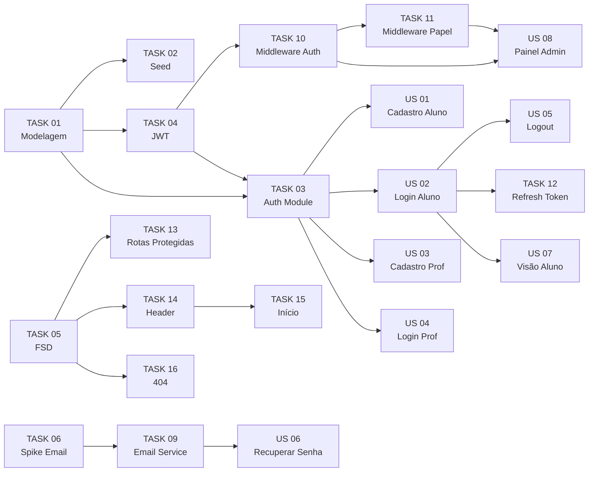

# Histórias e Tarefas - Release Major 1

Este documento contém as histórias de usuário e tarefas técnicas da **Release Major 1** do AnatoQuizUp, com estimativas, repositórios, dependências e critérios de aceitação ou conclusão.

## Visão geral

A Release Major 1 entrega a base de **cadastro de usuários** e **controle de acesso** do AnatoQuizUp. Esta release não inclui IA, gamificação ou questões; ela estabelece a fundação de autenticação, autorização e gestão de usuários para as próximas entregas do produto.

| Aspecto | Valor |
|---------|-------|
| Período da sprint | 17/04/2026 a 27/04/2026 |
| Data de entrega | Segunda-feira, 27/04/2026 |
| Total de histórias de usuário | 8 |
| Total de tarefas técnicas | 14 |
| Desenvolvedores disponíveis | 12 |

## Perfis de usuário

### Aluno

- Qualquer pessoa pode se cadastrar, com qualquer email válido.
- Status inicial: **ATIVO**, com acesso imediato após o cadastro.
- Pode marcar a opção **"Não estou matriculado em nenhuma universidade"** para pular os campos acadêmicos.

### Professor

- Cadastro inclui SIAPE com 7 dígitos numéricos e valor único.
- Status inicial: **PENDENTE**, aguardando aprovação do administrador.
- Após aprovação manual do Administrador, o status muda para **ATIVO**.

### Administrador

- Criado via seed no banco de dados, sem tela de cadastro.
- Aprova ou rejeita cadastros de professores.
- Gerencia ativação e desativação de contas.

## Escopo da release

### Incluído

- Cadastro e login de aluno.
- Cadastro e login de professor com aprovação administrativa.
- Logout e proteção de rotas.
- Recuperação de senha por email.
- Painel administrativo para gerenciamento de usuários.
- Estrutura inicial de autenticação, autorização, tokens e organização frontend/backend.

### Fora de escopo

- IA.
- Gamificação.
- Cadastro, geração ou resolução de questões.
- Funcionalidades acadêmicas além dos dados necessários ao cadastro.

## Dependências

## Resumo de pontos

### Por categoria

| Categoria | Quantidade | Pontos |
|-----------|------------|--------|
| Histórias de usuário | 8 | 42 |
| Tarefas técnicas | 14 | 29 |
| **Total** | **22** | **71** |

### Por repositório

| Repositório | Pontos |
|-------------|--------|
| Backend | 36 |
| Frontend | 30 |
| Fullstack | 5 |
| **Total** | **71** |

## Product Backlog

### US 01 - Cadastro de Aluno

> **Como** aluno  
> **Quero** me cadastrar na plataforma com meus dados pessoais  
> **Para** ter acesso ao sistema de quiz

> **Estimativa:** 5 pontos  
> **Repo:** Fullstack   
> **Epic:** Cadastro de Usuários    

#### Critérios de aceitação

- [ ] Ao acessar a página de cadastro, consigo preencher todos os campos obrigatórios de identificação pessoal e perfil acadêmico antes de criar minha conta.
- [ ] Os campos obrigatórios são: nome completo, email, senha, confirmação de senha, data de nascimento, nacionalidade, estado, cidade e escolaridade.
- [ ] Existe a flag **"Não estou matriculado em nenhuma universidade"**. Quando desmarcada, os campos instituição, curso e período aparecem e são obrigatórios. Quando marcada, esses campos somem do formulário.
- [ ] O campo nacionalidade oferece uma lista de opções para seleção.
- [ ] O campo estado oferece uma lista com os 26 estados brasileiros mais o Distrito Federal.
- [ ] O campo escolaridade oferece as opções: Ensino Fundamental, Ensino Médio, Graduação, Pós-graduação, Outro.
- [ ] Ao preencher todos os campos e clicar em **"Cadastrar"**, recebo confirmação visual de sucesso e sou direcionado para a tela de login.
- [ ] Se o email já estiver cadastrado, vejo mensagem de erro indicando isso e a conta não é criada.
- [ ] Se a senha tiver menos de 8 caracteres, vejo mensagem explicando o requisito mínimo.
- [ ] Se a senha e a confirmação forem diferentes, vejo a mensagem **"As senhas não coincidem"**.
- [ ] Nenhum campo obrigatório pode ser deixado em branco. Cada campo não preenchido exibe mensagem de erro individualizada.
- [ ] Na tela de cadastro há um link **"Já tem conta? Faça login"** que me leva para a tela de login.

### US 02 - Login de Aluno

> **Como** aluno cadastrado     
> **Quero** fazer login com meu email e senha   
> **Para** acessar a plataforma 

> **Estimativa:** 5 pontos  
> **Repo:** Fullstack   
> **Epic:** Cadastro de Usuários    

#### Critérios de aceitação

- [ ] Ao informar email e senha corretos e clicar em **"Entrar"**, sou direcionado para a página inicial e meu nome aparece na tela.
- [ ] Se email ou senha estiverem incorretos, vejo a mensagem **"Email ou senha inválidos"**, sem indicar qual dos dois está errado.
- [ ] Se minha conta estiver desativada, vejo a mensagem **"Conta desativada. Entre em contato com o administrador."**
- [ ] Se deixar email ou senha em branco, vejo mensagem indicando que os campos são obrigatórios.
- [ ] Na tela de login há um link **"Não tem conta? Cadastre-se"** que me leva para a tela de cadastro.
- [ ] Na tela de login há um link **"Esqueci minha senha"** que me leva para a recuperação.
- [ ] Na tela de login há um botão **"Entrar como Professor"** que me leva para a tela de login do professor.
- [ ] Na tela de login há um botão **"Entrar como Administrador"** que me leva para a tela de login do administrador.

### US 03 - Cadastro de Professor

> **Como** professor da UnB     
> **Quero** me cadastrar com meu email institucional e SIAPE    
> **Para** ter acesso ao sistema após aprovação do administrador    

> **Estimativa:** 8 pontos      
> **Repo:** Fullstack   
> **Epic:** Cadastro de Usuários    

#### Critérios de aceitação

- [ ] A página de cadastro do professor é acessada ao clicar em **"Cadastre-se"** na tela de login do professor.
- [ ] Os campos obrigatórios são: nome completo, email institucional, SIAPE, instituição com campo bloqueado mostrando **"Universidade de Brasília - UnB"**, departamento, curso, senha e confirmação de senha.
- [ ] O email é validado e deve terminar em `unb.br`, aceitando subdomínios como `aluno.unb.br` e `medicina.unb.br`.
- [ ] O SIAPE é validado e deve conter exatamente 7 dígitos numéricos.
- [ ] Se o email ou o SIAPE já estiverem cadastrados, vejo mensagem específica e a conta não é criada.
- [ ] Os campos departamento e curso aceitam texto livre.
- [ ] A senha deve ter no mínimo 8 caracteres e a confirmação deve coincidir.
- [ ] Após cadastrar com sucesso, vejo a mensagem **"Cadastro realizado! Seu cadastro está em análise pelo administrador. Você poderá acessar a plataforma após aprovação."**
- [ ] Minha conta é criada com status **PENDENTE** e não consigo logar até ser aprovada.
- [ ] Há um link **"Já tem conta? Faça login"** que leva para a tela de login do professor.

### US 04 - Login de Professor

> **Como** professor cadastrado     
> **Quero** fazer login com meu email institucional e senha     
> **Para** acessar a plataforma quando meu cadastro for aprovado    

> **Estimativa:** 5 pontos      
> **Repo:** Fullstack   
> **Epic:** Cadastro de Usuários    

#### Critérios de aceitação

- [ ] A página de login do professor é acessada ao clicar em **"Entrar como Professor"** na tela de login principal.
- [ ] Ao informar email e senha corretos e meu cadastro estar aprovado, sou direcionado para a página inicial.
- [ ] Se meu cadastro estiver pendente, vejo a mensagem **"Seu cadastro está em análise pelo administrador. Você receberá acesso em breve."**
- [ ] Se minha conta estiver desativada, vejo a mensagem **"Conta desativada. Entre em contato com o administrador."**
- [ ] Se as credenciais estiverem incorretas, vejo a mensagem **"Email ou senha inválidos"**.
- [ ] Há link **"Não tem conta? Cadastre-se"** que leva para o cadastro do professor.
- [ ] Há link **"Esqueci minha senha"** que leva para a recuperação de senha.
- [ ] Há link **"Voltar para login do aluno"** que leva para a tela de login principal.

### US 05 - Logout

> **Como** usuário logado   
> **Quero** sair da minha conta     
> **Para** encerrar minha sessão com segurança      

> **Estimativa:** 2 pontos      
> **Repo:** Fullstack       
> **Epic:** Cadastro de Usuários    

#### Critérios de aceitação

- [ ] Em todas as páginas após o login, há um botão **"Sair"** visível no cabeçalho.
- [ ] Ao clicar em **"Sair"**, minha sessão é encerrada e sou redirecionado para a tela de login.
- [ ] Após sair, se eu tentar acessar qualquer página do sistema diretamente pela URL, sou redirecionado para a tela de login.

### US 06 - Recuperação de Senha

> **Como** usuário que esqueceu a senha     
> **Quero** recuperá-la por email       
> **Para** voltar a acessar a plataforma    

> **Estimativa:** 5 pontos      
> **Repo:** Fullstack   
> **Epic:** Cadastro de Usuários    

#### Critérios de aceitação

- [ ] Ao clicar em **"Esqueci minha senha"** na tela de login, sou levado para uma página onde informo meu email.
- [ ] Ao informar o email e clicar em **"Enviar"**, vejo a mensagem **"Se o email existir no sistema, enviamos instruções de recuperação"**, independentemente de o email existir.
- [ ] Recebo um email com link de redefinição válido por 1 hora.
- [ ] Ao acessar o link e informar nova senha e confirmação, minha senha é atualizada e sou redirecionado para a tela de login.
- [ ] Se o link estiver expirado ou já tiver sido usado, vejo a mensagem **"Link expirado ou inválido. Solicite novamente."**
- [ ] O fluxo funciona igual para alunos e professores.

### US 07 - Visão de Aluno para o Professor

> **Como** professor    
> **Quero** alternar para a visão de aluno      
> **Para** visualizar o sistema exatamente como meus alunos o veem  

> **Estimativa:** 3 pontos      
> **Repo:** Frontend    
> **Epic:** Controle de Acesso  

#### Critérios de aceitação

- [ ] No menu do sistema, como professor, vejo um botão **"Ver como aluno"**.
- [ ] Ao clicar em **"Ver como aluno"**, a interface muda para exibir apenas as funcionalidades disponíveis para alunos.
- [ ] Enquanto na visão de aluno, um banner visível no topo da tela indica **"Você está na visão de aluno"**.
- [ ] Há um botão **"Voltar para visão de professor"** visível no banner.
- [ ] Ao clicar em **"Voltar para visão de professor"**, a interface retorna ao modo normal.
- [ ] A visão de aluno se mantém entre páginas e só é desativada ao clicar explicitamente em **"Voltar"**.

### US 08 - Painel de Administração de Usuários

> **Como** administrador    
> **Quero** visualizar, aprovar e gerenciar os usuários cadastrados     
> **Para** manter controle sobre quem tem acesso ao sistema     

> **Estimativa:** 9 pontos      
> **Repo:** Fullstack       
> **Epic:** Controle de Acesso      

#### Critérios de aceitação

- [ ] Como administrador, acesso o painel de gerenciamento de usuários e vejo uma lista com todos os usuários cadastrados, exibindo todos os dados do perfil: nome completo, email, tipo de conta, situação, data de cadastro, data de nascimento, nacionalidade, estado, cidade, escolaridade, instituição, curso, período, departamento e SIAPE quando professor.
- [ ] Há uma seção destacada no topo do painel chamada **"Aguardando aprovação"** com a lista de professores em status **PENDENTE**.
- [ ] Nos cards da seção de pendentes, há botões **"Aprovar"** e **"Rejeitar"**.
- [ ] Ao aprovar um professor pendente, seu status muda para **ATIVO** e ele consegue fazer login.
- [ ] Ao rejeitar um professor pendente, seu status muda para **INATIVO**, mantendo o cadastro para histórico.
- [ ] Para usuários ativos, há um botão **"Desativar"** que muda a situação para inativa.
- [ ] Para usuários inativos, há um botão **"Reativar"** que muda a situação para ativa.
- [ ] Ao clicar em um usuário da lista, abre uma visualização detalhada com todos os seus dados.
- [ ] Há um campo de busca que filtra usuários por nome ou email em tempo real.
- [ ] Há um filtro por situação: Todos, Pendentes, Ativos, Inativos.
- [ ] A lista é paginada.
- [ ] O administrador não consegue desativar a si mesmo nem alterar o status de outro administrador.
- [ ] Alunos e professores não conseguem acessar essa página e são redirecionados com a mensagem **"Acesso não autorizado"**.

## Project Backlog

### TASK 01 - Modelagem do banco de dados

> **Estimativa:** 3 pontos
> **Repo:** Backend
> **Tipo:** Infraestrutura
> **Bloqueia:** todas as US

#### Critérios de conclusão

- [ ] Schema Prisma criado com os modelos `User`, `RefreshToken` e `PasswordResetToken`.
- [ ] Enums `Papel` (`ALUNO`, `PROFESSOR`, `ADMINISTRADOR`) e `StatusUsuario` (`PENDENTE`, `ATIVO`, `INATIVO`) definidos.
- [ ] Campo SIAPE adicionado como único e nullable, usado apenas por professores.
- [ ] Campos do aluno incluídos: data de nascimento, nacionalidade, estado, cidade e escolaridade.
- [ ] Campos do professor incluídos: departamento.
- [ ] Migration inicial gerada e aplicada com sucesso no Docker local.
- [ ] `prisma generate` produz o client sem erro.
- [ ] `.env.example` atualizado com `DATABASE_URL` de referência.

### TASK 02 - Seed de administrador

> **Estimativa:** 1 ponto
> **Repo:** Backend
> **Tipo:** Infraestrutura
> **Bloqueado por:** TASK 01

#### Critérios de conclusão

- [ ] Script `prisma/seed.ts` criado.
- [ ] Credenciais lidas de variáveis de ambiente: `ADMIN_EMAIL` e `ADMIN_PASSWORD`.
- [ ] Senha hasheada com bcryptjs, usando 10 salt rounds.
- [ ] Seed idempotente, sem duplicar administrador quando rodar mais de uma vez.
- [ ] Comando `npm run seed` adicionado ao `package.json`.

### TASK 03 - Setup do módulo de autenticação no backend

> **Estimativa:** 3 pontos
> **Repo:** Backend
> **Tipo:** Infraestrutura
> **Bloqueado por:** TASK 01, TASK 04

#### Critérios de conclusão

- [ ] Estrutura `src/modules/auth/` criada com controller, service, repository, routes, schemas e DTOs.
- [ ] Schemas de validação Zod para login, cadastro, cadastro de professor, recuperação de senha, redefinição de senha e refresh.
- [ ] DTOs de request e response definidos com TypeScript.
- [ ] Arquivo de rotas com todos os endpoints mapeados.
- [ ] Rotas registradas no `index.ts` principal sob o prefixo `/api/v1`.
- [ ] Service e repository com métodos esqueleto.

### TASK 04 - Configuração JWT

> **Estimativa:** 2 pontos
> **Repo:** Backend
> **Tipo:** Infraestrutura
> **Bloqueado por:** TASK 01

#### Critérios de conclusão

- [ ] Lib `jsonwebtoken` instalada e configurada.
- [ ] `JWT_SECRET` e `JWT_REFRESH_SECRET` adicionados ao `.env` e `.env.example`.
- [ ] Função para gerar access token com expiração de 60 minutos.
- [ ] Função para gerar refresh token com expiração de 7 dias.
- [ ] Função para verificar token com tratamento de erros.
- [ ] Funções localizadas em `src/shared/utils/jwt.ts`.
- [ ] Testes unitários cobrindo geração, verificação, expiração e assinatura inválida.

### TASK 05 - Setup da estrutura FSD no frontend

> **Estimativa:** 2 pontos
> **Repo:** Frontend
> **Tipo:** Infraestrutura

#### Critérios de conclusão

- [ ] Estrutura de pastas `app/`, `pages/`, `widgets/`, `features/`, `entities/` e `shared/` criada.
- [ ] `shared/api/httpClient.ts` com Axios configurado, usando `baseURL` via `VITE_API_URL`.
- [ ] `entities/user/model/types.ts` com tipagem dos enums `Papel` e `StatusUsuario` em PT-BR.
- [ ] `app/router.tsx` com React Router e rotas placeholder.
- [ ] `app/App.tsx` renderizando o router.
- [ ] Componentes base em `shared/ui/`: Button e Input.
- [ ] `npm run dev` sobe sem erro.

### TASK 06 - Spike: pesquisa de lib de envio de email

> **Estimativa:** 1 ponto
> **Repo:** Backend
> **Tipo:** Spike
> **Timebox:** 4 horas

#### Critérios de conclusão

- [ ] Pelo menos 3 opções comparadas, como Resend, Nodemailer com Gmail, SendGrid ou Mailtrap.
- [ ] Critérios de comparação documentados: free tier, facilidade e documentação.
- [ ] Lib escolhida com justificativa.
- [ ] Teste rápido de envio de email realizado com a lib escolhida.
- [ ] Variáveis de ambiente necessárias documentadas.
- [ ] Comentário na issue ou documento curto com a decisão.

### TASK 09 - Configuração do serviço de email

> **Estimativa:** 2 pontos
> **Repo:** Backend
> **Tipo:** Infraestrutura
> **Bloqueado por:** TASK 06

#### Critérios de conclusão

- [ ] Lib escolhida no spike instalada e configurada.
- [ ] Variáveis de ambiente adicionadas ao `.env` e `.env.example`.
- [ ] Função `sendPasswordResetEmail(to, resetLink)` criada em `src/shared/services/emailService.ts`.
- [ ] Template HTML do email de redefinição com logo, link e aviso de expiração em 1 hora.
- [ ] Teste manual de envio de email funcional.
- [ ] Falha no envio é logada, mas não derruba o endpoint.

### TASK 10 - Middleware de autenticação

> **Estimativa:** 3 pontos
> **Repo:** Backend
> **Tipo:** Técnica
> **Bloqueado por:** TASK 04

#### Critérios de conclusão

- [ ] Middleware criado em `src/shared/middlewares/autenticacao.middleware.ts`.
- [ ] Verifica header `Authorization: Bearer <token>` e decodifica o JWT.
- [ ] Popula `req.user` com `{ userId, papel, email }`.
- [ ] Status do usuário verificado a cada requisição: `PENDENTE` ou `INATIVO` retorna 403.
- [ ] Rotas públicas excluídas: cadastro, cadastro de professor, login, refresh, recuperação de senha e redefinição de senha.
- [ ] Testes cobrindo token válido, ausente, expirado, inválido, usuário pendente e usuário inativo.

### TASK 11 - Middleware de autorização por papel

> **Estimativa:** 2 pontos
> **Repo:** Backend
> **Tipo:** Técnica
> **Bloqueado por:** TASK 10

#### Critérios de conclusão

- [ ] Middleware criado em `src/shared/middlewares/autorizacao.middleware.ts`.
- [ ] Função `autorizar(...papeisPermitidos)` retorna um middleware.
- [ ] Middleware lê `req.user.papel` e bloqueia com 403 se o usuário não estiver autorizado.
- [ ] Testes cobrindo papel correto, papel incorreto e múltiplos papéis aceitos.

### TASK 12 - Renovação automática de sessão

> **Estimativa:** 3 pontos
> **Repo:** Fullstack
> **Tipo:** Técnica
> **Bloqueado por:** TASK 04, US 02

#### Critérios de conclusão

- [ ] Endpoint `POST /api/v1/autenticacao/atualizar-token` recebe refresh token e retorna novo par de tokens.
- [ ] Refresh token antigo é deletado do banco, aplicando rotation.
- [ ] Refresh token inválido, expirado ou já usado retorna 401.
- [ ] Interceptor no frontend detecta 401 e tenta atualizar token automaticamente.
- [ ] Se o refresh falhar no frontend, limpa estado e redireciona para login.
- [ ] Não há loop infinito: o frontend não tenta refresh do próprio endpoint de refresh.

### TASK 13 - Rotas protegidas no frontend

> **Estimativa:** 3 pontos
> **Repo:** Frontend
> **Tipo:** Técnica
> **Bloqueado por:** TASK 05, US 02

#### Critérios de conclusão

- [ ] Componente `RotaProtegida` criado com prop `papeisPermitidos?: Papel[]`.
- [ ] Sem token, redireciona para `/login`.
- [ ] Com token válido e papel não autorizado, redireciona para `/inicio` com mensagem.
- [ ] Com token válido e papel autorizado, renderiza children.
- [ ] Todas as rotas protegidas no `router.tsx` usam o componente.

### TASK 14 - Widget de navegação

> **Estimativa:** 2 pontos
> **Repo:** Frontend
> **Tipo:** Infraestrutura
> **Bloqueado por:** TASK 05, US 02

#### Critérios de conclusão

- [ ] Widget `widgets/header/ui/Header.tsx` criado.
- [ ] Exibe nome do usuário logado.
- [ ] Menu adapta por papel: Aluno com Início, Professor com Início e toggle, Administrador com Início e Gerenciar usuários.
- [ ] Botão de logout funcional.
- [ ] Layout responsivo.

### TASK 15 - Página Início

> **Estimativa:** 1 ponto
> **Repo:** Frontend
> **Tipo:** Infraestrutura
> **Bloqueado por:** TASK 05, TASK 14

#### Critérios de conclusão

- [ ] Page `pages/inicio/` criada.
- [ ] Mensagem de boas-vindas: **"Bem-vindo(a), {nome}!"**
- [ ] Layout com Header.
- [ ] Rota `/inicio` protegida via `RotaProtegida`, permitindo qualquer papel autenticado.

### TASK 16 - Tela de erro 404 e fallback

> **Estimativa:** 1 ponto
> **Repo:** Frontend
> **Tipo:** Infraestrutura
> **Bloqueado por:** TASK 05

#### Critérios de conclusão

- [ ] Page `pages/nao-encontrada/` criada com mensagem amigável e link para voltar à home.
- [ ] Rota catch-all (`*`) no React Router apontando para a página 404.
- [ ] Error boundary em `app/` capturando erros de renderização.

## Histórico de Versão

| Data   | Versão | Descrição | Autor(es) |
|--------|--------|-----------|-----------|
| 27/04/2026 | 1.0 | Criação das histórias e tarefas da Release Major 1 | [Breno Fernandes](https://github.com/Brenofrds) |
| 27/04/2026 | 1.1 | Adição da visão geral, escopo, dependências e convenções da Release Major 1 | [Breno Fernandes](https://github.com/Brenofrds) |
