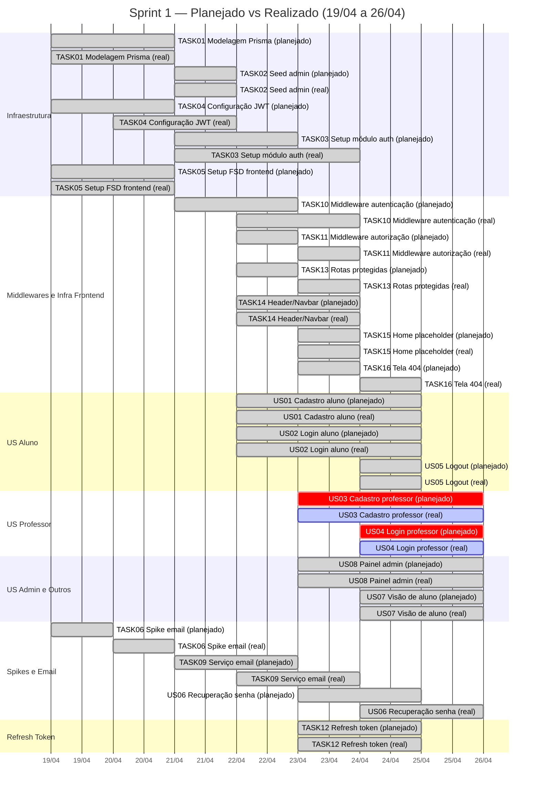

# EVM Ágil — Sprint 1

## Parâmetros da sprint

| Parâmetro | Valor | Observação |
|-----------|-------|------------|
| Período | 19/04 a 26/04/2026 | Sprint de 8 dias |
| Duração | 8 dias | |
| Taxa horas por ponto | 3,0 h/pt | Inicial. Recalibrar após Sprint 1 com média real. |
| Baseline do projeto | 960 horas | 12 pessoas × 8 h/sem × 10 semanas |

---

## Valores da Sprint 1

### Métricas base

| Métrica | Valor | De onde vem |
|---------|-------|-------------|
| **VP** — Valor Planejado (pontos) | 91 | Soma dos pontos das US planejadas para a sprint |
| **VA** — Valor Agregado (pontos) | 71 | Soma dos pontos das US com status Done |
| **VP em horas-equivalente** | 273,0 h | VP × taxa h/pt |
| **VA em horas-equivalente** | 213,0 h | VA × taxa h/pt |
| **CR** — Custo Real (horas) | 140,0 h | Soma das horas registradas pelo time na sprint |

### Índices de desempenho

| Índice | Valor | Interpretação |
|--------|-------|---------------|
| **SPI** — Schedule Performance Index | **0,78** | < 1 → atrasado em relação ao planejado |
| **CPI** — Cost Performance Index | **1,52** | > 1 → eficiente (entregou mais valor por hora gasta) |

### Projeção

| Métrica | Valor | Descrição |
|---------|-------|-----------|
| Baseline do projeto | 960 h | Capacidade total planejada |
| **EAC** (Estimate at Completion) | 631 h | Baseline / CPI — projeção de horas totais |
| Desvio esperado | -329 h | EAC - Baseline (negativo = abaixo do orçamento) |

### Diagnóstico

!!! warning "Situação: Atrasado no cronograma, eficiente no custo"
    **SPI 0,78** indica que entregamos 78% do planejado. Os 20 pontos não entregues correspondem às US de professor (US03 e US04) que foram adiadas devido à mudança de escopo de SSO Microsoft para cadastro local com SIAPE. A decisão de adiar foi deliberada para evitar retrabalho enquanto a definição final do fluxo de professor é fechada com os POs.

    **CPI 1,52** indica que o time está entregando mais valor por hora investida do que o estimado. As horas reais ficaram abaixo do previsto, o que sugere que as estimativas de esforço foram conservadoras ou que o time foi produtivo acima da média.

---

## Gráfico de Gantt — Planejado vs Realizado

### Legenda do Gantt
- **done** (verde) = entregue conforme planejado
- **crit / active** (vermelho/azul) = não entregue na sprint — US03 e US04 (professor) adiadas por mudança de escopo

---

## Análise da Sprint 1

### O que foi entregue (71 pontos)

Toda a infraestrutura técnica (14 tasks), cadastro e login de aluno (US01, US02), logout (US05), recuperação de senha (US06), painel de administração (US08), visão de aluno do professor (US07) e refresh token (TASK12).

### O que não foi entregue (20 pontos)

US03 (Cadastro de professor — 8pts) e US04 (Login de professor — 5pts), além de ajustes planejados para o fluxo de aprovação no painel admin (estimados em ~7pts adicionais). A causa foi a mudança de escopo no fluxo de professor: a decisão de migrar de SSO Microsoft para cadastro local com SIAPE aconteceu durante a sprint e o time optou por adiar a implementação de professor para evitar retrabalho enquanto a definição final é fechada com os POs.

### Ações para a próxima sprint

1. Fechar definição do fluxo de professor com os POs (SSO ou SIAPE — decisão final)
2. Priorizar US03 e US04 como primeiros cards da Sprint 2
3. Melhorar registro de horas (R19 da matriz de riscos) — muitos membros não preencheram
4. Recalibrar taxa h/pt com base nas horas reais da Sprint 1
