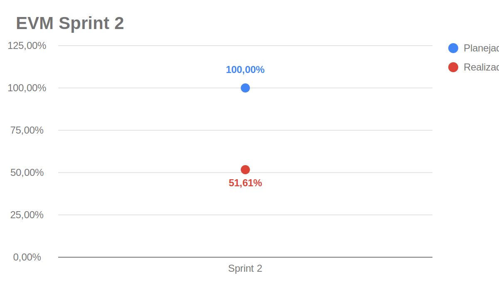
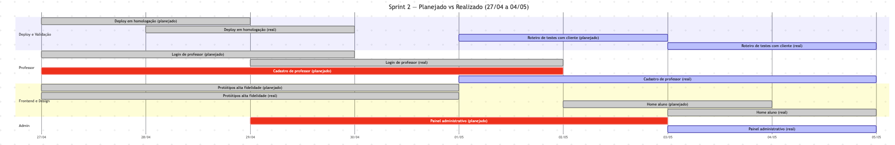

# EVM Ágil — Sprint 2

O EVM (*Earned Value Management*) é usado para acompanhar a relação entre o valor planejado, o valor efetivamente agregado e o custo consumido pelo projeto. Neste documento, o EVM foi adaptado ao contexto ágil usando pontos de história/cards como medida de escopo e o [Plano de Custos](plano-de-custos.md) como base para o custo financeiro estimado da sprint.

## Legenda

| Métrica | Descrição |
|---------|-----------|
| **PRP** | Pontos planejados para a sprint |
| **RPC** | Pontos concluídos na sprint |
| **APC** | Percentual real de pontos concluídos (`RPC / PRP`) |
| **PPC** | Percentual planejado para a sprint |
| **BAC** | Orçamento estimado para a sprint |
| **PV** | Valor planejado (`PPC x BAC`) |
| **EV** | Valor agregado (`APC x BAC`) |
| **AC** | Custo real estimado da sprint |
| **CV** | Variação de custo (`EV - AC`) |
| **SV** | Variação de cronograma (`EV - PV`) |
| **CPI** | Índice de desempenho de custo (`EV / AC`) |
| **SPI** | Índice de desempenho de prazo (`EV / PV`) |

---

## Parâmetros da Sprint 2

| Parâmetro | Valor | Observação |
|-----------|-------|------------|
| Período | 27/04 a 04/05/2026 | Sprint semanal após a Release Major 1 |
| Duração | 8 dias | Inclui consolidação pós-entrega da Sprint 1 |
| Integrantes considerados | 10 pessoas | Redução em relação à Sprint 1 |
| Carga por integrante | 4 h | Ajuste informado para a sprint |
| PRP | 31 pontos | Pontos planejados/remanescentes de professor, deploy, protótipos e validação |
| RPC | 16 pontos | Pontos fechados com estimativa mensurável |
| Fonte dos cards | Zenhub + GitHub Issues | Consulta à workspace `2026-1-AnatoQuizUp` em 20/05/2026 |

---

## Custo da Sprint

Os custos foram derivados do [Plano de Custos](plano-de-custos.md). Como o plano-base usa 9 integrantes e 14 h semanais por integrante, os itens variáveis foram proporcionalizados para **10 integrantes com 4 h por pessoa**. A hospedagem foi mantida como custo fixo semanal.

| Categoria | Cálculo aplicado | Custo |
|-----------|------------------|------:|
| Hora de trabalho dos integrantes | R$ 309,02 por estudante/semana x `4/14` x 10 integrantes | R$ 882,91 |
| Computadores | R$ 13,46 por computador/semana x 10 integrantes | R$ 134,61 |
| Energia | R$ 1,26 por integrante/semana x `4/10` x 10 integrantes | R$ 5,04 |
| Internet | R$ 1,39 por integrante/semana x `4/10` x 10 integrantes | R$ 5,56 |
| Hospedagem e deploy | Custo semanal Railway Hobby | R$ 6,34 |
| **Total estimado da sprint** |  | **R$ 1.034,46** |

---

## Valores EVM da Sprint 2

| Métrica | Valor | Descrição |
|---------|------:|-----------|
| **PRP** | 31 pts | Pontos planejados |
| **RPC** | 16 pts | Pontos concluídos |
| **APC** | 51,61% | `16 / 31` |
| **PPC** | 100,00% | Escopo planejado da sprint |
| **BAC** | R$ 1.034,46 | Orçamento estimado da sprint |
| **PV** | R$ 1.034,46 | Valor planejado |
| **EV** | R$ 533,27 | Valor agregado |
| **AC** | R$ 1.034,46 | Custo estimado consumido |
| **CV** | -R$ 501,19 | Variação de custo |
| **SV** | -R$ 501,19 | Variação de cronograma |
| **CPI** | 0,52 | `EV / AC` |
| **SPI** | 0,52 | `EV / PV` |

## Gráfico EVM

!!! info "Lógica dos dados do gráfico"
    O ponto azul representa o percentual planejado acumulado para a sprint. O ponto vermelho representa o percentual realmente concluído, calculado por `RPC / PRP`. Na Sprint 2, foram concluídos 16 dos 31 pontos planejados, resultando em **51,61%** de realização.

### Diagnóstico

!!! warning "Situação: atraso e baixo valor agregado frente ao custo estimado"
    A Sprint 2 concluiu **51,61%** dos pontos planejados. Como o custo estimado da sprint foi considerado integral, o **CPI 0,52** e o **SPI 0,52** indicam que o valor agregado ficou abaixo do esperado tanto em custo quanto em cronograma.

    A principal causa foi a continuidade das pendências da Sprint 1: cadastro/login de professor, painel administrativo e validações com cliente ainda dependiam de ajustes de fluxo.

---

## Gráfico de Gantt — Planejado vs Realizado

---

## Análise da Sprint 2

### O que foi entregue (16 pontos)

| Card | Pontos | Evidência |
|------|-------:|-----------|
| Doc #2 — Protótipos de alta fidelidade | 8 | Fechado em 01/05/2026 |
| Usuario-Service #23 — Deploy em homologação | 2 | Fechado em 29/04/2026 |
| Usuario-Service #18 — Login de professor — Tela | 3 | Fechado em 01/05/2026 |
| Web #38 — Home aluno | 3 | Fechado em 04/05/2026; estimativa inferida do backlog de requisitos |

### O que não foi entregue ou ficou sem mensuração

Cadastro de professor, painel administrativo e documentação de endpoints permaneceram como pendências ou foram concluídos apenas em sprints posteriores. O card Web #39 de correção de Security Hotspots foi fechado na sprint, mas não tinha estimativa registrada e por isso não entrou no cálculo de valor agregado.

### Ações para a próxima sprint

1. Fechar cadastro de professor no backend e frontend.
2. Concluir entregas do painel administrativo ou reduzir escopo para validação.
3. Garantir estimate em todos os cards antes de iniciar a sprint.
4. Manter o registro de horas por integrante para comparar custo estimado e esforço efetivo.

## Histórico de Versão

| Data | Versão | Descrição | Autor(es) |
|------|--------|-----------|-----------|
| 21/05/2026 | 1.0 | Adequação ao modelo Agile EVM e ao plano de custos do projeto | maria Luisa |
