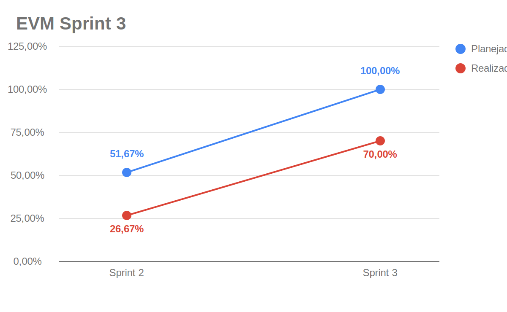
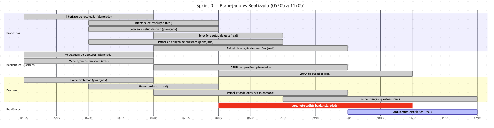

# EVM Ágil — Sprint 3

!!! warning "Modelo superado — ver EVM Consolidado"
    Esta página calcula o EVM **por sprint isolada com `AC = BAC`** (custo realizado = planejado), o que força **CPI ≡ SPI** e impede projeção de término. O cálculo **corrigido e cumulativo** (`AC` = custo da equipe efetiva, independente do orçamento) está em **[EVM Consolidado](evm-consolidado.md)** e no [Dashboard de Projeto](https://fga-eps-mds.github.io/2026-1-AnatoQuizUp-Doc/dashboards/projeto.html).

O EVM (*Earned Value Management*) é usado para acompanhar a relação entre o valor planejado, o valor efetivamente agregado e o custo consumido pelo projeto. Neste documento, o EVM foi adaptado ao contexto ágil usando pontos de história/cards como medida de escopo e o [Plano de Custos](plano-de-custos.md) como base para o custo financeiro estimado da sprint.

## Legenda

| Métrica | Descrição |
|---------|-----------|
| **PRP** | Pontos planejados para a sprint |
| **RPC** | Pontos concluídos na sprint |
| **APC** | Percentual real de pontos concluídos (`RPC / PRP`) |
| **PPC** | Percentual planejado para a sprint |
| **BAC** | Orçamento estimado para a sprint |
| **PV** | Valor planejado (`PPC x BAC`) |
| **EV** | Valor agregado (`APC x BAC`) |
| **AC** | Custo real estimado da sprint |
| **CV** | Variação de custo (`EV - AC`) |
| **SV** | Variação de cronograma (`EV - PV`) |
| **CPI** | Índice de desempenho de custo (`EV / AC`) |
| **SPI** | Índice de desempenho de prazo (`EV / PV`) |

---

## Parâmetros da Sprint 3

| Parâmetro | Valor | Observação |
|-----------|-------|------------|
| Período | 05/05 a 11/05/2026 | Sprint semanal da Release Major 2 |
| Duração | 7 dias | |
| Integrantes considerados | 9 pessoas | Quantidade base do plano de custos |
| Carga por integrante | 4 h | Ajuste informado para a sprint |
| PRP | 29 pontos | Questões, protótipos, modelagem e home professor |
| RPC | 26 pontos | Pontos fechados com estimativa mensurável |
| Fonte dos cards | Zenhub + GitHub Issues | Consulta à workspace `2026-1-AnatoQuizUp` em 20/05/2026 |

---

## Custo da Sprint

Os custos foram derivados do [Plano de Custos](plano-de-custos.md). Como o plano-base usa 9 integrantes e 14 h semanais por integrante, os itens variáveis foram proporcionalizados para **9 integrantes com 4 h por pessoa**. A hospedagem foi mantida como custo fixo semanal.

| Categoria | Cálculo aplicado | Custo |
|-----------|------------------|------:|
| Hora de trabalho dos integrantes | R$ 309,02 por estudante/semana x `4/14` x 9 integrantes | R$ 794,62 |
| Computadores | Custo semanal de depreciação para 9 computadores | R$ 121,15 |
| Energia | R$ 11,34 semanais x `4/10` | R$ 4,54 |
| Internet | R$ 12,50 semanais x `4/10` | R$ 5,00 |
| Hospedagem e deploy | Custo semanal Railway Hobby | R$ 6,34 |
| **Total estimado da sprint** |  | **R$ 931,65** |

---

## Valores EVM da Sprint 3

| Métrica | Valor | Descrição |
|---------|------:|-----------|
| **PRP** | 29 pts | Pontos planejados |
| **RPC** | 26 pts | Pontos concluídos |
| **APC** | 89,66% | `26 / 29` |
| **PPC** | 100,00% | Escopo planejado da sprint |
| **BAC** | R$ 931,65 | Orçamento estimado da sprint |
| **PV** | R$ 931,65 | Valor planejado |
| **EV** | R$ 835,96 | Valor agregado |
| **AC** | R$ 931,65 | Custo estimado consumido |
| **CV** | -R$ 95,69 | Variação de custo |
| **SV** | -R$ 95,69 | Variação de cronograma |
| **CPI** | 0,90 | `EV / AC` |
| **SPI** | 0,90 | `EV / PV` |

## Gráfico EVM

!!! info "Lógica dos dados do gráfico"
    O gráfico usa percentuais acumulados até a sprint exibida. A linha azul mostra o avanço planejado acumulado e a linha vermelha mostra o avanço real acumulado. Até a Sprint 3, foram planejados 60 pontos e concluídos 42 pontos, resultando em **70,00%** de realização acumulada.

### Diagnóstico

!!! info "Situação: cronograma quase aderente"
    A Sprint 3 concluiu **89,66%** dos pontos planejados. O **CPI 0,90** e o **SPI 0,90** indicam pequena defasagem em relação ao custo e ao cronograma planejados.

    A sprint avançou especialmente em protótipos do fluxo de quiz, modelagem de questões, CRUD de questões e interface inicial do professor. Parte do trabalho ligado à arquitetura distribuída e à integração de ponta a ponta permaneceu para a sprint seguinte.

---

## Gráfico de Gantt — Planejado vs Realizado

---

## Análise da Sprint 3

### O que foi entregue (26 pontos)

| Card | Pontos | Evidência |
|------|-------:|-----------|
| Doc #7 — Protótipo da interface dinâmica de resolução e feedback | 3 | Fechado em 08/05/2026 |
| Doc #11 — Protótipo de seleção de tema e configuração de quiz | 2 | Fechado em 08/05/2026 |
| Doc #13 — Protótipo do painel de criação de questões | 3 | Fechado em 07/05/2026 |
| Doc #17 — Protótipo das telas de histórico e revisão | 2 | Fechado em 08/05/2026 |
| Usuario-Service #47 — Modelagem do banco de questões | 3 | Fechado em 06/05/2026; estimativa inferida pelo padrão do backlog |
| Usuario-Service #50 — Gerenciamento de questões (CRUD) | 5 | Fechado em 10/05/2026 |
| Web #36 — Interface do painel de criação de questões | 5 | Fechado em 11/05/2026 |
| Web #37 — Home professor | 3 | Fechado em 07/05/2026; estimativa inferida do backlog de requisitos |

### O que não foi entregue ou ficou sem mensuração

O roteiro de testes e a correção de alguns pontos de qualidade/documentação não tinham estimates consistentes. A arquitetura distribuída começou a ser discutida e preparada, mas seu fechamento ocorreu apenas na Sprint 4.

### Ações para a próxima sprint

1. Finalizar a arquitetura distribuída e deploy dos serviços.
2. Fechar cadastro de professor API + tela.
3. Avançar no fluxo de turmas e alocação de alunos.
4. Padronizar estimates para cards técnicos e de documentação.

## Histórico de Versão

| Data | Versão | Descrição | Autor(es) |
|------|--------|-----------|-----------|
| 21/05/2026 | 1.0 | Criação do EVM da Sprint 3 com base em Zenhub, GitHub Issues| Maria luisa |
