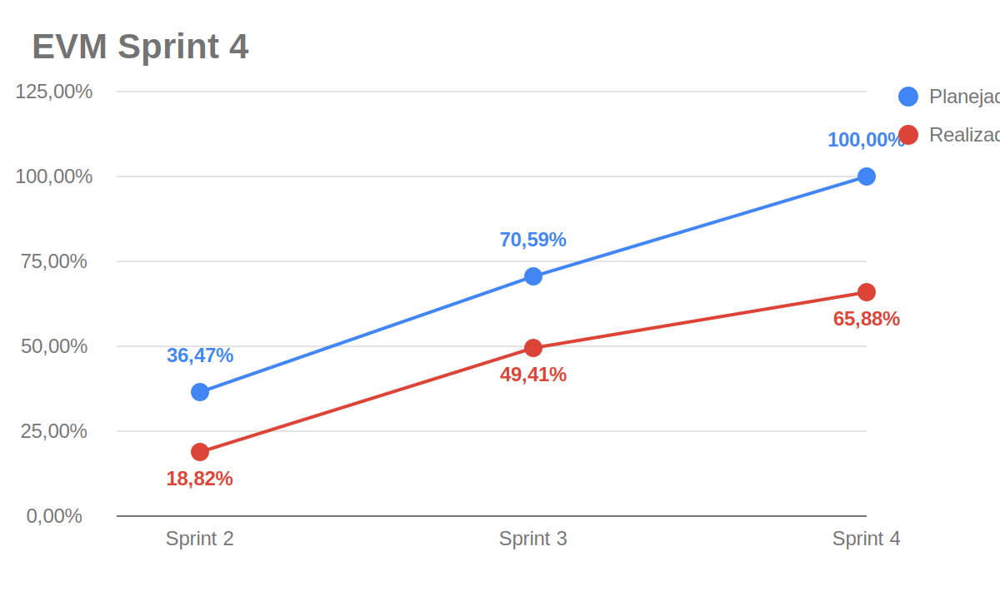
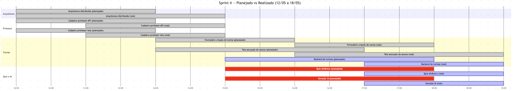

# EVM Ágil — Sprint 4

O EVM (*Earned Value Management*) é usado para acompanhar a relação entre o valor planejado, o valor efetivamente agregado e o custo consumido pelo projeto. Neste documento, o EVM foi adaptado ao contexto ágil usando pontos de história/cards como medida de escopo e o [Plano de Custos](plano-de-custos.md) como base para o custo financeiro estimado da sprint.

## Legenda

| Métrica | Descrição |
|---------|-----------|
| **PRP** | Pontos planejados para a sprint |
| **RPC** | Pontos concluídos na sprint |
| **APC** | Percentual real de pontos concluídos (`RPC / PRP`) |
| **PPC** | Percentual planejado para a sprint |
| **BAC** | Orçamento estimado para a sprint |
| **PV** | Valor planejado (`PPC x BAC`) |
| **EV** | Valor agregado (`APC x BAC`) |
| **AC** | Custo real estimado da sprint |
| **CV** | Variação de custo (`EV - AC`) |
| **SV** | Variação de cronograma (`EV - PV`) |
| **CPI** | Índice de desempenho de custo (`EV / AC`) |
| **SPI** | Índice de desempenho de prazo (`EV / PV`) |

---

## Parâmetros da Sprint 4

| Parâmetro | Valor | Observação |
|-----------|-------|------------|
| Período | 12/05 a 18/05/2026 | Sprint semanal da Release Major 2 |
| Duração | 7 dias | |
| Integrantes considerados | 9 pessoas | Quantidade base do plano de custos |
| Carga por integrante | 4 h | Ajuste informado para a sprint |
| PRP | 25 pontos | Arquitetura, professor e turmas |
| RPC | 14 pontos | Pontos fechados com estimativa mensurável |
| Fonte dos cards | Zenhub + GitHub Issues | Consulta à workspace `2026-1-AnatoQuizUp` em 20/05/2026 |

---

## Custo da Sprint

Os custos foram derivados do [Plano de Custos](plano-de-custos.md). Como o plano-base usa 9 integrantes e 14 h semanais por integrante, os itens variáveis foram proporcionalizados para **9 integrantes com 4 h por pessoa**. A hospedagem foi mantida como custo fixo semanal.

| Categoria | Cálculo aplicado | Custo |
|-----------|------------------|------:|
| Hora de trabalho dos integrantes | R$ 309,02 por estudante/semana x `4/14` x 9 integrantes | R$ 794,62 |
| Computadores | Custo semanal de depreciação para 9 computadores | R$ 121,15 |
| Energia | R$ 11,34 semanais x `4/10` | R$ 4,54 |
| Internet | R$ 12,50 semanais x `4/10` | R$ 5,00 |
| Hospedagem e deploy | Custo semanal Railway Hobby | R$ 6,34 |
| **Total estimado da sprint** |  | **R$ 931,65** |

---

## Valores EVM da Sprint 4

| Métrica | Valor | Descrição |
|---------|------:|-----------|
| **PRP** | 25 pts | Pontos planejados |
| **RPC** | 14 pts | Pontos concluídos |
| **APC** | 56,00% | `14 / 25` |
| **PPC** | 100,00% | Escopo planejado da sprint |
| **BAC** | R$ 931,65 | Orçamento estimado da sprint |
| **PV** | R$ 931,65 | Valor planejado |
| **EV** | R$ 521,72 | Valor agregado |
| **AC** | R$ 931,65 | Custo estimado consumido |
| **CV** | -R$ 409,93 | Variação de custo |
| **SV** | -R$ 409,93 | Variação de cronograma |
| **CPI** | 0,56 | `EV / AC` |
| **SPI** | 0,56 | `EV / PV` |

## Gráfico EVM

!!! info "Lógica dos dados do gráfico"
    O gráfico usa percentuais acumulados até a sprint exibida. A linha azul divide o total planejado acumulado entre as sprints consideradas, enquanto a linha vermelha acumula apenas pontos concluídos. Até a Sprint 4, foram planejados 85 pontos e concluídos 56 pontos, resultando em **65,88%** de realização acumulada.

### Diagnóstico

!!! warning "Situação: atraso de cronograma e valor agregado abaixo do custo estimado"
    A Sprint 4 concluiu **56,00%** dos pontos planejados. O **CPI 0,56** e o **SPI 0,56** indicam que o valor agregado ficou abaixo do custo e do prazo planejados.

    A leitura deve considerar uma limitação: o card de arquitetura distribuída foi fechado, mas não possuía estimate no Zenhub/GitHub. Ele aparece como entrega qualitativa, sem entrar no valor agregado mensurável.

---

## Gráfico de Gantt — Planejado vs Realizado

---

## Análise da Sprint 4

### O que foi entregue (14 pontos mensuráveis)

| Card | Pontos | Evidência |
|------|-------:|-----------|
| Usuario-Service #17 — Cadastro de professor — API | 3 | Fechado em 14/05/2026; estimativa inferida do backlog de requisitos |
| Web #12 — Cadastro de professor — Tela | 3 | Fechado em 14/05/2026 |
| Web #43 — Formulário de criação de turma | 3 | Fechado em 18/05/2026 |
| Web #44 — Tela de alocação de alunos | 5 | Fechado em 18/05/2026 |

### Entregas qualitativas sem estimate

| Card | Evidência | Observação |
|------|-----------|------------|
| Doc #29 — Arquitetura distribuída e deploy | Fechado em 19/05/2026 | Sem estimate; não entrou no EV |
| Doc #21 — Cadastro de professor | Fechado em 14/05/2026 | Card agregador sem estimate |
| Doc #22 — Cadastro e gestão de questão | Fechado em 15/05/2026 | Card agregador sem estimate |

### O que não foi entregue

Backend de turmas, visualização de turmas pelo aluno, quiz dinâmico, listas de questões, geração de questões com IA e dashboard analítico permaneceram em andamento ou no backlog da sprint seguinte.

### Ações para a próxima sprint

1. Completar backend e frontend de turmas do aluno.
2. Priorizar listas de questões e quiz dinâmico antes de ampliar o escopo de IA.
3. Quebrar cards agregadores grandes em entregas estimáveis.
4. Registrar horas efetivas por sprint para comparar com o custo estimado.

## Histórico de Versão

| Data | Versão | Descrição | Autor(es) |
|------|--------|-----------|-----------|
| 21/05/2026 | 1.0 | Adequação ao modelo Agile EVM e ao plano de custos do projeto | Maria Luisa |
