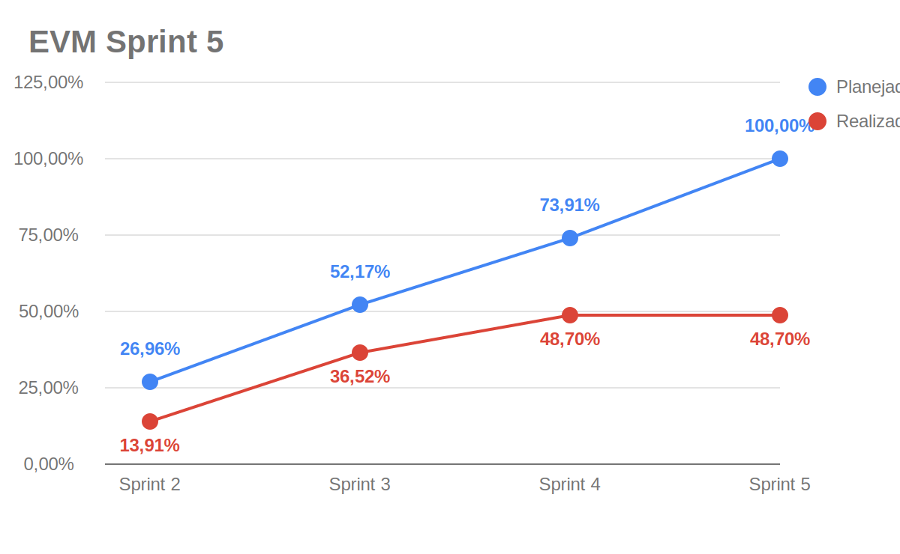

# EVM Ágil — Sprint 5

!!! warning "Sprint em andamento"
    Este EVM registra a situação parcial da Sprint 5. Como a sprint ainda não foi finalizada, os valores de pontos concluídos, EV, CPI e SPI devem ser revisados no fechamento.

O EVM (*Earned Value Management*) é usado para acompanhar a relação entre o valor planejado, o valor efetivamente agregado e o custo consumido pelo projeto. Neste documento, o EVM foi adaptado ao contexto ágil usando pontos de história/cards como medida de escopo e o [Plano de Custos](plano-de-custos.md) como base para o custo financeiro estimado da sprint.

## Legenda

| Métrica | Descrição |
|---------|-----------|
| **PRP** | Pontos planejados para a sprint |
| **RPC** | Pontos concluídos na sprint |
| **APC** | Percentual real de pontos concluídos (`RPC / PRP`) |
| **PPC** | Percentual planejado para a sprint |
| **BAC** | Orçamento estimado para a sprint |
| **PV** | Valor planejado (`PPC x BAC`) |
| **EV** | Valor agregado (`APC x BAC`) |
| **AC** | Custo real estimado da sprint |
| **CV** | Variação de custo (`EV - AC`) |
| **SV** | Variação de cronograma (`EV - PV`) |
| **CPI** | Índice de desempenho de custo (`EV / AC`) |
| **SPI** | Índice de desempenho de prazo (`EV / PV`) |

---

## Parâmetros da Sprint 5

| Parâmetro | Valor | Observação |
|-----------|-------|------------|
| Período | 19/05 a 25/05/2026 | Sprint semanal da Release Major 2 |
| Duração | 7 dias | Sprint em andamento |
| Integrantes considerados | 9 pessoas | Mantida a capacidade das Sprints 3 e 4 |
| Carga por integrante | 4 h | Ajuste informado para a sprint |
| PRP | 30 pontos | Soma dos cards mensuráveis em andamento/validação |
| RPC | 0 pontos | Sem fechamento final da sprint até este registro |
| Fonte dos cards | Zenhub + atas de reunião | Baseado na última coleta disponível e no planejamento de 17/05/2026 |

---

## Custo da Sprint

Os custos foram derivados do [Plano de Custos](plano-de-custos.md). Como o plano-base usa 9 integrantes e 14 h semanais por integrante, os itens variáveis foram proporcionalizados para **9 integrantes com 4 h por pessoa**. A hospedagem foi mantida como custo fixo semanal.

| Categoria | Cálculo aplicado | Custo |
|-----------|------------------|------:|
| Hora de trabalho dos integrantes | R$ 309,02 por estudante/semana x `4/14` x 9 integrantes | R$ 794,62 |
| Computadores | Custo semanal de depreciação para 9 computadores | R$ 121,15 |
| Energia | R$ 11,34 semanais x `4/10` | R$ 4,54 |
| Internet | R$ 12,50 semanais x `4/10` | R$ 5,00 |
| Hospedagem e deploy | Custo semanal Railway Hobby | R$ 6,34 |
| **Total estimado da sprint** |  | **R$ 931,65** |

---

## Valores EVM da Sprint 5

| Métrica | Valor | Descrição |
|---------|------:|-----------|
| **PRP** | 30 pts | Pontos planejados mensuráveis |
| **RPC** | 0 pts | Pontos concluídos no fechamento parcial |
| **APC** | 0,00% | `0 / 30` |
| **PPC** | 100,00% | Escopo planejado da sprint |
| **BAC** | R$ 931,65 | Orçamento estimado da sprint |
| **PV** | R$ 931,65 | Valor planejado |
| **EV** | R$ 0,00 | Valor agregado parcial |
| **AC** | R$ 931,65 | Custo estimado consumido, se considerada a sprint completa |
| **CV** | -R$ 931,65 | Variação de custo parcial |
| **SV** | -R$ 931,65 | Variação de cronograma parcial |
| **CPI** | 0,00 | `EV / AC` |
| **SPI** | 0,00 | `EV / PV` |

## Gráfico EVM

!!! info "Lógica dos dados do gráfico"
    O gráfico da Sprint 5 é acumulado e parcial. A linha azul considera o total planejado das Sprints 2 a 5, chegando a **100,00%** na Sprint 5. A linha vermelha mantém o realizado acumulado em **48,70%**, pois a Sprint 5 ainda não possui pontos fechados neste registro.

### Diagnóstico

!!! warning "Situação parcial: execução em andamento"
    O SPI e o CPI aparecem como **0,00** na leitura isolada da Sprint 5 porque ainda não há pontos concluídos registrados para o fechamento da sprint. Esse valor não deve ser interpretado como resultado final, mas como fotografia intermediária.

    Os principais focos planejados são recompensas por acertos, visualização de turmas pelo aluno, listas de questões, geração de questões com IA e dashboard analítico.

---

## Gráfico de Gantt — Planejado vs Realizado

!!! note "Gantt ainda não consolidado"
    A imagem de Gantt da Sprint 5 deve ser adicionada ao final da sprint, quando as datas reais de execução estiverem consolidadas.

---

## Acompanhamento parcial da Sprint 5

### Cards mensuráveis considerados no PRP (30 pontos)

| Card | Pontos | Situação parcial |
|------|-------:|------------------|
| Doc #33 — Dashboard Gerencial e Analítico | 3 | Em andamento |
| Usuario-Service #46 — Agregação de Histórico | 4 | Sprint Backlog |
| Usuario-Service #48 — Validação e Registro de Tentativa | 4 | Review/QA |
| Usuario-Service #49 — Filtro e Randomização de Quiz | 4 | Review/QA |
| Web #34 — Aba de Histórico e Revisão | 4 | Sprint Backlog |
| Web #33 — Interface Dinâmica de Questionário | 5 | Em andamento |
| Web #35 — Interface de Seleção e Setup do Quiz | 3 | Em andamento |
| Web #20 — Painel de administração de usuários | 3 | Em andamento |

### Itens planejados sem estimate

| Card | Observação |
|------|------------|
| Usuario-Service #77 — Sistema de Recompensas por Acertos | Planejado na ata de 17/05, sem estimate mensurável na última coleta |
| Usuario-Service #93 — Listas de Questões | Planejado na ata de 17/05, sem estimate mensurável na última coleta |
| Usuario-Service #94 — Criação de Turmas e Alocação de Alunos | Em validação, sem estimate mensurável na última coleta |
| Doc #25 — Visualização de Turmas (Aluno) | Planejado, sem estimate mensurável na última coleta |
| Doc #27 — Geração de Questões com Inteligência Artificial | Planejado, sem estimate mensurável na última coleta |

### Ações para fechamento

1. Atualizar RPC com os cards efetivamente fechados.
2. Recalcular EV, CV, SV, CPI e SPI após o fechamento da sprint.
3. Inserir imagem de Gantt da Sprint 5.
4. Registrar estimates ausentes nos cards planejados para evitar submedição do escopo.

## Histórico de Versão

| Data | Versão | Descrição | Autor(es) |
|------|--------|-----------|-----------|
| 21/05/2026 | 0.1 | Criação parcial do EVM da Sprint 5 | Maria Luisa |
